# Technical Specifications

## 1. INTRODUCTION

### EXECUTIVE SUMMARY

| Aspect | Description |
|--------|-------------|
| Project Overview | A simple Node.js HTTP server application that exposes a single REST endpoint `/hello` which returns "Hello world" to clients |
| Business Problem | Provides a minimal, functional example of a Node.js web service that can serve as a learning tool or starter template |
| Key Stakeholders | Developers learning Node.js, technical trainers, software engineers requiring a baseline implementation |
| Value Proposition | Delivers a clean, working reference implementation that demonstrates Node.js HTTP server fundamentals with minimal complexity |

### SYSTEM OVERVIEW

#### Project Context

The Node.js Hello World service operates as a standalone educational tool in the following context:

- **Business Context**: Serves as an entry-level tutorial for Node.js REST API development
- **Current Limitations**: Addresses the need for simplified learning examples that focus on core concepts without additional complexity
- **Integration Landscape**: Functions as a self-contained application that can be extended to integrate with other systems

#### High-Level Description

| Component | Description |
|-----------|-------------|
| Primary Capabilities | HTTP server that listens for requests and responds with text output |
| Major Components | Node.js runtime, HTTP server module, single route handler |
| Technical Approach | RESTful API design principles with minimal dependencies |

#### Success Criteria

| Criteria Type | Description |
|---------------|-------------|
| Measurable Objectives | - Server successfully starts and listens on configured port<br>- `/hello` endpoint returns "Hello world" with appropriate HTTP status code<br>- Documentation enables new users to run the application |
| Critical Success Factors | - Simplicity and clarity of implementation<br>- Reliability of the endpoint<br>- Accessibility for beginners |
| Key Performance Indicators | - Time to understand and implement<br>- Error-free execution<br>- Minimal resource consumption |

### SCOPE

#### In-Scope

**Core Features and Functionalities**
- HTTP server implementation in Node.js
- Single REST endpoint (`/hello`) returning text response
- Basic error handling for server startup
- Appropriate HTTP status codes and headers

**Implementation Boundaries**
- Single-server architecture
- Local development environment
- Command-line interface for starting/stopping
- Standard HTTP protocol support

#### Out-of-Scope

- Authentication and authorization mechanisms
- Database integration or persistent storage
- Multiple endpoints beyond `/hello`
- Production deployment configurations
- Logging infrastructure
- Performance optimization
- Containerization
- Testing frameworks
- Frontend user interface
- API documentation generation
- Continuous integration/deployment setup

## 2. PRODUCT REQUIREMENTS

### FEATURE CATALOG

#### Feature Metadata

| ID | Feature Name | Feature Category | Priority Level | Status |
|----|--------------|------------------|----------------|--------|
| F-001 | HTTP Server | Core Infrastructure | Critical | Proposed |
| F-002 | Hello Endpoint | API | Critical | Proposed |
| F-003 | Server Configuration | Infrastructure | High | Proposed |

#### Feature Descriptions

**F-001: HTTP Server**

| Aspect | Description |
|--------|-------------|
| Overview | A Node.js HTTP server that listens for incoming requests on a specified port |
| Business Value | Provides the foundation for serving HTTP requests in a lightweight, efficient manner |
| User Benefits | Enables developers to understand the basics of creating a web server in Node.js |
| Technical Context | Uses Node.js built-in HTTP module or Express.js to handle HTTP protocol communication |

**F-002: Hello Endpoint**

| Aspect | Description |
|--------|-------------|
| Overview | REST endpoint at path `/hello` that returns "Hello world" text response |
| Business Value | Demonstrates the fundamental concept of routing and responding to HTTP requests |
| User Benefits | Provides a working example of handling specific routes in a Node.js application |
| Technical Context | Implements request handling logic to process GET requests to the `/hello` path |

**F-003: Server Configuration**

| Aspect | Description |
|--------|-------------|
| Overview | Configuration settings for the HTTP server including port number and host |
| Business Value | Enables flexibility in deployment and execution environments |
| User Benefits | Allows developers to customize server settings without code changes |
| Technical Context | Implements environment variable support or configuration file parsing |

#### Dependencies

**F-001: HTTP Server**

| Dependency Type | Description |
|-----------------|-------------|
| Prerequisite Features | None |
| System Dependencies | Node.js runtime environment |
| External Dependencies | None |
| Integration Requirements | None |

**F-002: Hello Endpoint**

| Dependency Type | Description |
|-----------------|-------------|
| Prerequisite Features | F-001 (HTTP Server) |
| System Dependencies | None |
| External Dependencies | None |
| Integration Requirements | None |

**F-003: Server Configuration**

| Dependency Type | Description |
|-----------------|-------------|
| Prerequisite Features | None |
| System Dependencies | Node.js runtime environment |
| External Dependencies | None |
| Integration Requirements | None |

### FUNCTIONAL REQUIREMENTS TABLE

**F-001: HTTP Server**

| Requirement ID | Description | Acceptance Criteria | Priority |
|----------------|-------------|---------------------|----------|
| F-001-RQ-001 | The system shall initialize an HTTP server using Node.js | Server starts without errors | Must-Have |
| F-001-RQ-002 | The server shall listen on a configurable TCP port | Server binds to specified port | Must-Have |
| F-001-RQ-003 | The server shall handle incoming HTTP requests | Server receives and processes requests | Must-Have |
| F-001-RQ-004 | The server shall return appropriate HTTP status codes | All responses include valid status codes | Must-Have |

**Technical Specifications for F-001**

| Aspect | Specification |
|--------|---------------|
| Input Parameters | HTTP requests |
| Output/Response | HTTP responses with appropriate status codes and headers |
| Performance Criteria | Server startup time < 1 second |
| Data Requirements | None |

**Validation Rules for F-001**

| Rule Type | Description |
|-----------|-------------|
| Business Rules | None |
| Data Validation | Validate port number is within valid range (1-65535) |
| Security Requirements | None |
| Compliance Requirements | None |

**F-002: Hello Endpoint**

| Requirement ID | Description | Acceptance Criteria | Priority |
|----------------|-------------|---------------------|----------|
| F-002-RQ-001 | The system shall implement a GET endpoint at path `/hello` | Endpoint exists and responds to GET requests | Must-Have |
| F-002-RQ-002 | The `/hello` endpoint shall return the text "Hello world" | Response body contains exactly "Hello world" | Must-Have |
| F-002-RQ-003 | The `/hello` endpoint shall return HTTP 200 status code | Response includes 200 status code | Must-Have |
| F-002-RQ-004 | The `/hello` endpoint shall set appropriate content type | Response includes "Content-Type: text/plain" header | Should-Have |

**Technical Specifications for F-002**

| Aspect | Specification |
|--------|---------------|
| Input Parameters | HTTP GET request to `/hello` path |
| Output/Response | Text response "Hello world" with 200 status code |
| Performance Criteria | Response time < 100ms |
| Data Requirements | None |

**Validation Rules for F-002**

| Rule Type | Description |
|-----------|-------------|
| Business Rules | None |
| Data Validation | None |
| Security Requirements | None |
| Compliance Requirements | None |

**F-003: Server Configuration**

| Requirement ID | Description | Acceptance Criteria | Priority |
|----------------|-------------|---------------------|----------|
| F-003-RQ-001 | The system shall use a default port of 3000 if not configured | Server starts on port 3000 when no port specified | Must-Have |
| F-003-RQ-002 | The system shall support port configuration via environment variable | Server uses PORT environment variable when available | Should-Have |
| F-003-RQ-003 | The system shall log the port number on startup | Console output includes bound port number | Should-Have |

**Technical Specifications for F-003**

| Aspect | Specification |
|--------|---------------|
| Input Parameters | Environment variables, command line arguments |
| Output/Response | Server configuration settings |
| Performance Criteria | Configuration parsing time < 50ms |
| Data Requirements | None |

**Validation Rules for F-003**

| Rule Type | Description |
|-----------|-------------|
| Business Rules | None |
| Data Validation | Validate port is a positive integer |
| Security Requirements | None |
| Compliance Requirements | None |

### FEATURE RELATIONSHIPS

#### Feature Dependencies Map

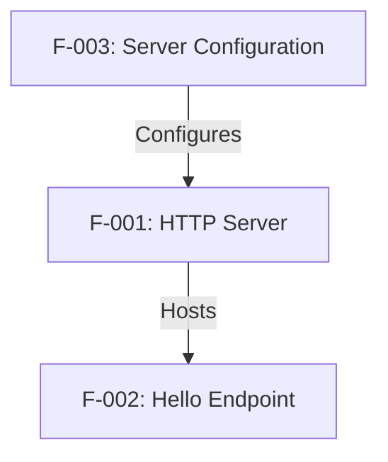
```mermaid
graph TD
    F001[F-001: HTTP Server]
    F002[F-002: Hello Endpoint]
    F003[F-003: Server Configuration]
    
    F003 -->|Configures| F001
    F001 -->|Hosts| F002
```

#### Integration Points

| Feature | Integration Point | Description |
|---------|-------------------|-------------|
| F-001 | Node.js Runtime | Server relies on Node.js HTTP module |
| F-003 | Operating System | Configuration may use environment variables |

### IMPLEMENTATION CONSIDERATIONS

**F-001: HTTP Server**

| Consideration | Description |
|---------------|-------------|
| Technical Constraints | Must use Node.js HTTP module or Express.js |
| Performance Requirements | Low memory footprint, quick startup time |
| Scalability Considerations | None for tutorial purposes |
| Security Implications | None for tutorial purposes |
| Maintenance Requirements | Minimal, focused on educational clarity |

**F-002: Hello Endpoint**

| Consideration | Description |
|---------------|-------------|
| Technical Constraints | Must return plain text response |
| Performance Requirements | Fast response time |
| Scalability Considerations | None for tutorial purposes |
| Security Implications | None for tutorial purposes |
| Maintenance Requirements | Minimal, focused on educational clarity |

**F-003: Server Configuration**

| Consideration | Description |
|---------------|-------------|
| Technical Constraints | Must support environment variable configuration |
| Performance Requirements | None |
| Scalability Considerations | None for tutorial purposes |
| Security Implications | None for tutorial purposes |
| Maintenance Requirements | Minimal, focused on educational clarity |

### TRACEABILITY MATRIX

| Requirement ID | Feature ID | Description | Verification Method |
|----------------|------------|-------------|---------------------|
| F-001-RQ-001 | F-001 | Initialize HTTP server | Manual Testing |
| F-001-RQ-002 | F-001 | Listen on configurable port | Manual Testing |
| F-001-RQ-003 | F-001 | Handle HTTP requests | Manual Testing |
| F-001-RQ-004 | F-001 | Return appropriate status codes | Manual Testing |
| F-002-RQ-001 | F-002 | Implement `/hello` endpoint | Manual Testing |
| F-002-RQ-002 | F-002 | Return "Hello world" text | Manual Testing |
| F-002-RQ-003 | F-002 | Return HTTP 200 status | Manual Testing |
| F-002-RQ-004 | F-002 | Set appropriate content type | Manual Testing |
| F-003-RQ-001 | F-003 | Use default port 3000 | Manual Testing |
| F-003-RQ-002 | F-003 | Support PORT environment variable | Manual Testing |
| F-003-RQ-003 | F-003 | Log port number on startup | Manual Testing |

## 3. TECHNOLOGY STACK

### PROGRAMMING LANGUAGES

| Component | Language | Version | Justification |
|-----------|----------|---------|---------------|
| Server | JavaScript | ES6+ | Native language for Node.js runtime, ideal for lightweight HTTP servers and asynchronous I/O operations |
| Runtime | Node.js | 18.x LTS | Long-term support version provides stability and security updates for educational purposes |

**Selection Criteria:**
- JavaScript is the native language for Node.js, providing a consistent development experience
- Node.js offers excellent performance for I/O-bound applications like simple HTTP servers
- Single language stack simplifies the learning curve for beginners

### FRAMEWORKS & LIBRARIES

| Component | Framework/Library | Version | Purpose | Justification |
|-----------|-------------------|---------|---------|---------------|
| HTTP Server | Node.js HTTP module | Built-in | Core server functionality | Native module provides direct access to HTTP functionality without additional dependencies |
| HTTP Server (Alternative) | Express.js | 4.18.x | Web framework | Optional enhancement that simplifies routing and middleware if more endpoints are added later |

**Compatibility Requirements:**
- Node.js v14.x or higher required for all components
- No browser compatibility concerns as this is server-side only

**Framework Selection Justification:**
- Native HTTP module aligns with the minimal approach and educational focus
- Zero external dependencies reduces complexity and potential security issues
- Express.js listed as an alternative for scenarios requiring more robust routing

### OPEN SOURCE DEPENDENCIES

| Dependency | Version | Purpose | Source |
|------------|---------|---------|--------|
| Node.js runtime | 18.x LTS | JavaScript execution environment | nodejs.org |

**Package Management:**
- npm (Node Package Manager) for dependency management
- package.json for project metadata and script definitions
- No additional runtime dependencies required for core functionality

### DEVELOPMENT & DEPLOYMENT

| Category | Tool/Technology | Version | Purpose |
|----------|-----------------|---------|---------|
| Development | npm | 8.x+ | Package management and script execution |
| Development | nodemon | 2.0.x | Optional development dependency for auto-restart during development |
| Version Control | Git | 2.x+ | Source code management |
| Code Quality | ESLint | 8.x | Optional static code analysis |

**Development Environment:**
- Any text editor or IDE with JavaScript support (VS Code recommended)
- Terminal/command line for running Node.js commands
- Local Node.js installation

**Deployment Options:**
- Direct Node.js execution on host system
- Manual deployment to hosting services that support Node.js

**Build Process:**
- No build step required; Node.js directly executes JavaScript source code
- Simple npm scripts for starting the server

### TECHNOLOGY STACK DIAGRAM

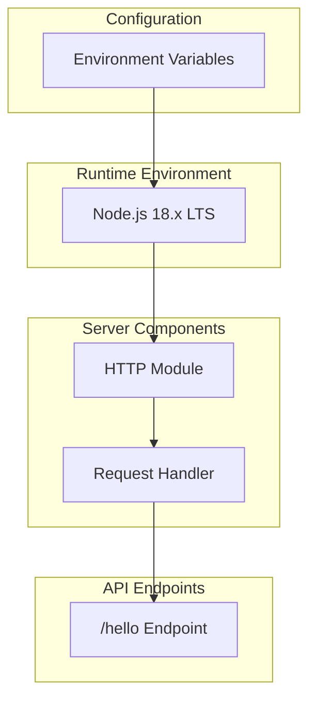
```mermaid
graph TD
    subgraph "Runtime Environment"
        A[Node.js 18.x LTS]
    end
    
    subgraph "Server Components"
        B[HTTP Module]
        C[Request Handler]
    end
    
    subgraph "API Endpoints"
        D["/hello Endpoint"]
    end
    
    subgraph "Configuration"
        E[Environment Variables]
    end
    
    A --> B
    B --> C
    C --> D
    E --> A
```

## 4. PROCESS FLOWCHART

### SYSTEM WORKFLOWS

#### Core Business Processes

##### HTTP Request Processing Workflow

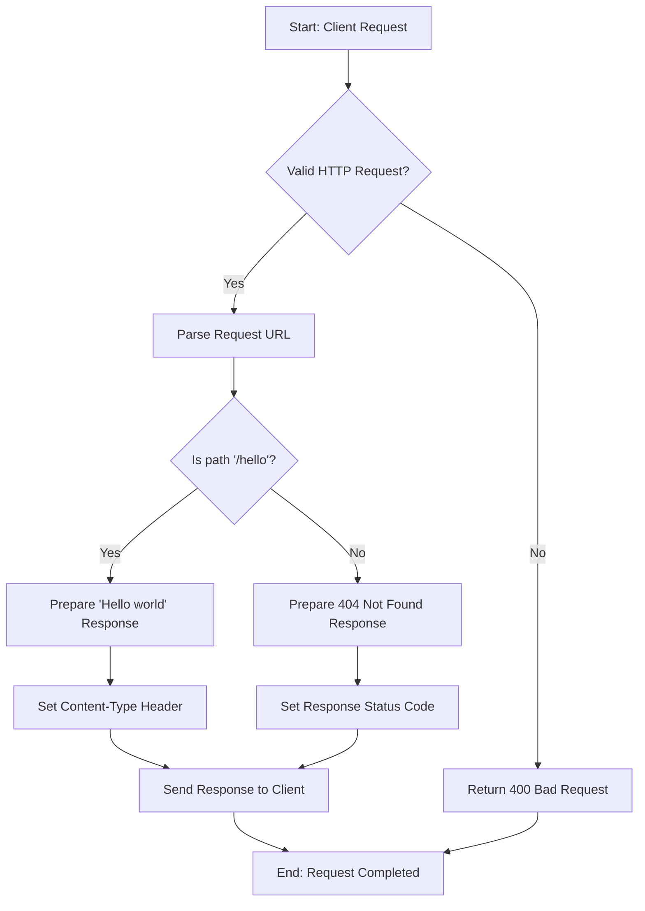
```mermaid
flowchart TD
    A[Start: Client Request] --> B{Valid HTTP Request?}
    B -->|Yes| C[Parse Request URL]
    B -->|No| D[Return 400 Bad Request]
    C --> E{Is path '/hello'?}
    E -->|Yes| F[Prepare 'Hello world' Response]
    E -->|No| G[Prepare 404 Not Found Response]
    F --> H[Set Content-Type Header]
    G --> I[Set Response Status Code]
    H --> J[Send Response to Client]
    I --> J
    J --> K[End: Request Completed]
    D --> K
```

**Workflow Description:**
1. Client initiates HTTP request to server
2. Server validates the HTTP request format
3. If valid, server parses the request URL
4. Server checks if the requested path is '/hello'
5. For '/hello' path, server prepares "Hello world" response with 200 status
6. For other paths, server prepares 404 Not Found response
7. Server sets appropriate headers and sends response to client
8. Request processing completes

##### Server Startup Workflow

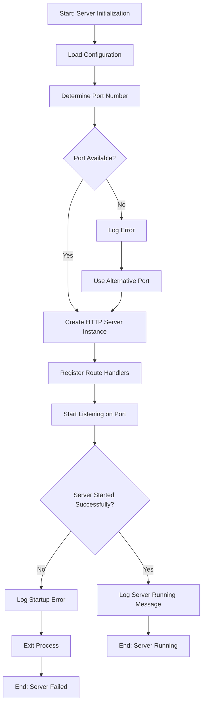
```mermaid
flowchart TD
    A[Start: Server Initialization] --> B[Load Configuration]
    B --> C[Determine Port Number]
    C --> D{Port Available?}
    D -->|Yes| E[Create HTTP Server Instance]
    D -->|No| F[Log Error]
    F --> G[Use Alternative Port]
    G --> E
    E --> H[Register Route Handlers]
    H --> I[Start Listening on Port]
    I --> J{Server Started Successfully?}
    J -->|Yes| K[Log Server Running Message]
    J -->|No| L[Log Startup Error]
    L --> M[Exit Process]
    K --> N[End: Server Running]
    M --> O[End: Server Failed]
```

**Workflow Description:**
1. Server initialization begins
2. Configuration is loaded from environment variables
3. Port number is determined (default 3000 or from environment)
4. Server checks if port is available
5. HTTP server instance is created
6. Route handlers are registered (including '/hello')
7. Server begins listening on configured port
8. Success or failure is logged appropriately

#### Integration Workflows

##### Client-Server Interaction Flow

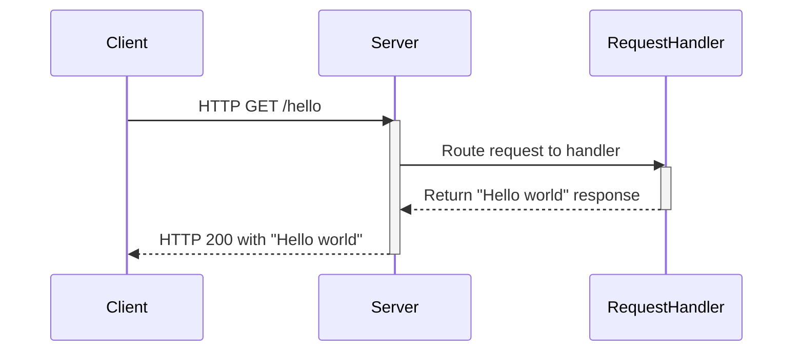
```mermaid
sequenceDiagram
    participant Client
    participant Server
    participant RequestHandler
    
    Client->>Server: HTTP GET /hello
    activate Server
    Server->>RequestHandler: Route request to handler
    activate RequestHandler
    RequestHandler-->>Server: Return "Hello world" response
    deactivate RequestHandler
    Server-->>Client: HTTP 200 with "Hello world"
    deactivate Server
```

**Workflow Description:**
1. Client sends HTTP GET request to '/hello' endpoint
2. Server receives request and routes to appropriate handler
3. Request handler processes the request and generates response
4. Server returns HTTP 200 response with "Hello world" text
5. Client receives and processes response

### FLOWCHART REQUIREMENTS

#### Request Processing Flow with Validation

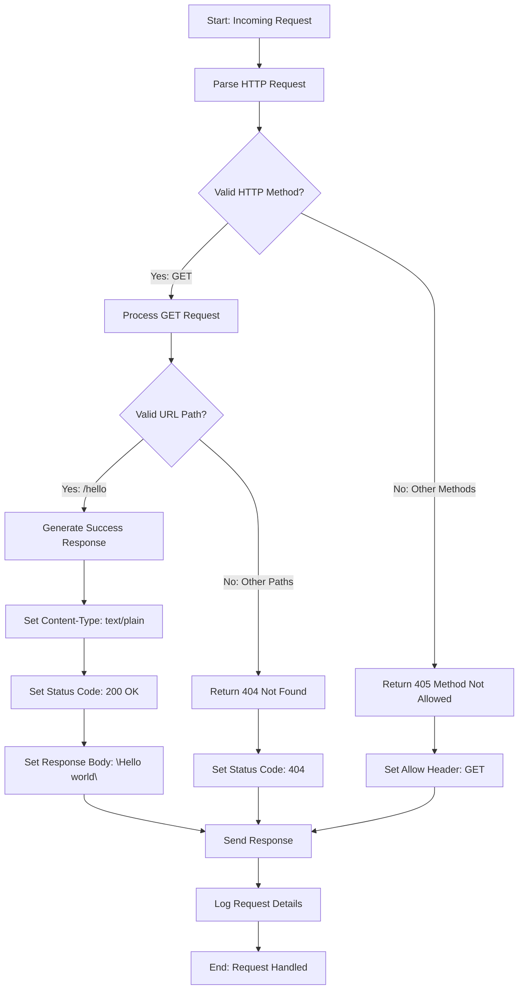
```mermaid
flowchart TD
    A[Start: Incoming Request] --> B[Parse HTTP Request]
    B --> C{Valid HTTP Method?}
    C -->|Yes: GET| D[Process GET Request]
    C -->|No: Other Methods| E[Return 405 Method Not Allowed]
    D --> F{Valid URL Path?}
    F -->|Yes: /hello| G[Generate Success Response]
    F -->|No: Other Paths| H[Return 404 Not Found]
    G --> I[Set Content-Type: text/plain]
    I --> J[Set Status Code: 200 OK]
    J --> K["Set Response Body: \"Hello world\""]
    H --> L[Set Status Code: 404]
    E --> M[Set Allow Header: GET]
    K --> N[Send Response]
    L --> N
    M --> N
    N --> O[Log Request Details]
    O --> P[End: Request Handled]
```

**Validation Rules:**
- Only GET HTTP method is allowed for '/hello' endpoint
- URL path must exactly match '/hello'
- Response must have Content-Type header set to 'text/plain'
- Response must have appropriate status code (200, 404, 405)

#### Error Handling Flow

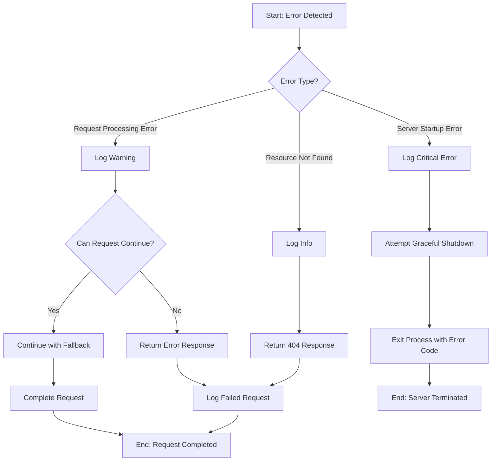
```mermaid
flowchart TD
    A[Start: Error Detected] --> B{Error Type?}
    B -->|Server Startup Error| C[Log Critical Error]
    B -->|Request Processing Error| D[Log Warning]
    B -->|Resource Not Found| E[Log Info]
    C --> F[Attempt Graceful Shutdown]
    D --> G{Can Request Continue?}
    G -->|Yes| H[Continue with Fallback]
    G -->|No| I[Return Error Response]
    E --> J[Return 404 Response]
    F --> K[Exit Process with Error Code]
    H --> L[Complete Request]
    I --> M[Log Failed Request]
    J --> M
    K --> N[End: Server Terminated]
    L --> O[End: Request Completed]
    M --> O
```

**Error Types and Handling:**
1. **Server Startup Errors:**
   - Port already in use
   - Insufficient permissions
   - Invalid configuration
   
2. **Request Processing Errors:**
   - Malformed HTTP request
   - Unsupported HTTP method
   - Internal server error
   
3. **Resource Not Found Errors:**
   - Invalid URL path
   - Missing resource

### TECHNICAL IMPLEMENTATION

#### State Management Flow

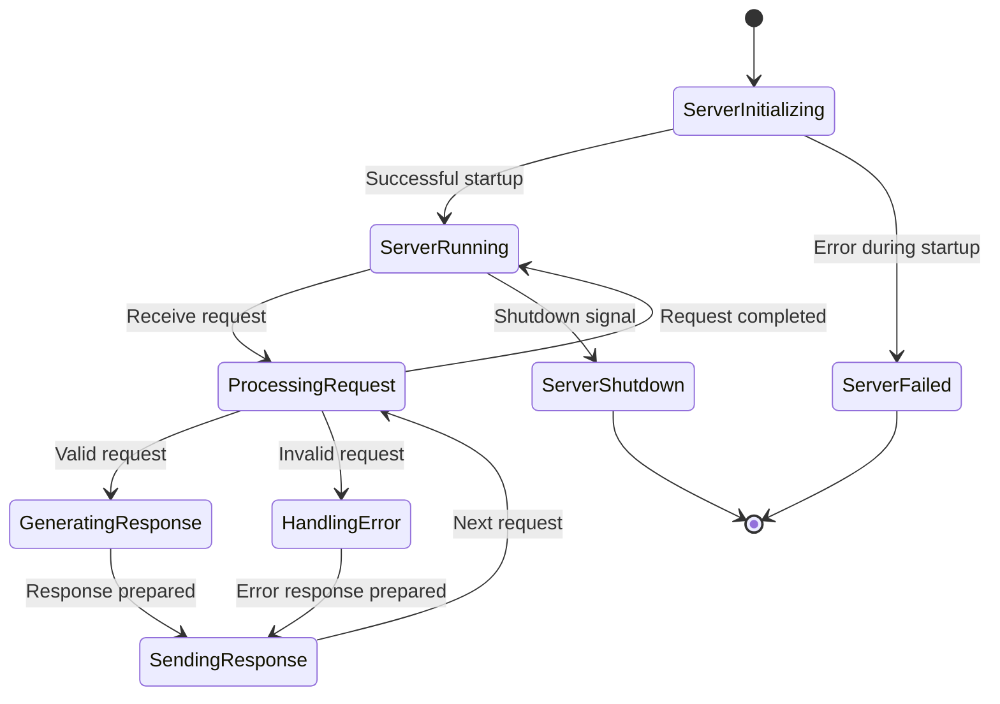
```mermaid
stateDiagram-v2
    [*] --> ServerInitializing
    ServerInitializing --> ServerRunning: Successful startup
    ServerInitializing --> ServerFailed: Error during startup
    
    ServerRunning --> ProcessingRequest: Receive request
    ProcessingRequest --> ServerRunning: Request completed
    
    ProcessingRequest --> GeneratingResponse: Valid request
    ProcessingRequest --> HandlingError: Invalid request
    
    GeneratingResponse --> SendingResponse: Response prepared
    HandlingError --> SendingResponse: Error response prepared
    
    SendingResponse --> ProcessingRequest: Next request
    
    ServerRunning --> ServerShutdown: Shutdown signal
    ServerFailed --> [*]
    ServerShutdown --> [*]
```

**State Descriptions:**
- **ServerInitializing:** Loading configuration, setting up handlers
- **ServerRunning:** Listening for incoming connections
- **ServerFailed:** Critical error prevented server startup
- **ProcessingRequest:** Parsing and validating incoming HTTP request
- **GeneratingResponse:** Creating successful response for valid request
- **HandlingError:** Creating error response for invalid request
- **SendingResponse:** Transmitting response to client
- **ServerShutdown:** Graceful termination of server process

#### Error Handling Implementation

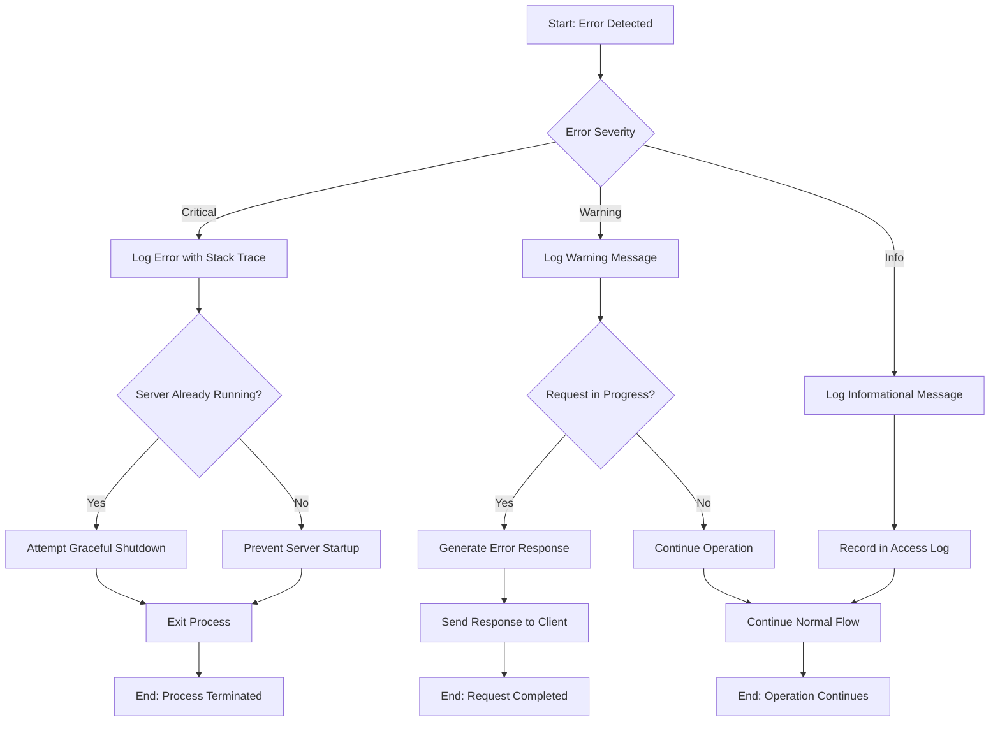
```mermaid
flowchart TD
    A[Start: Error Detected] --> B{Error Severity}
    B -->|Critical| C[Log Error with Stack Trace]
    B -->|Warning| D[Log Warning Message]
    B -->|Info| E[Log Informational Message]
    
    C --> F{Server Already Running?}
    F -->|Yes| G[Attempt Graceful Shutdown]
    F -->|No| H[Prevent Server Startup]
    
    D --> I{Request in Progress?}
    I -->|Yes| J[Generate Error Response]
    I -->|No| K[Continue Operation]
    
    E --> L[Record in Access Log]
    
    G --> M[Exit Process]
    H --> M
    J --> N[Send Response to Client]
    K --> O[Continue Normal Flow]
    L --> O
    
    M --> P[End: Process Terminated]
    N --> Q[End: Request Completed]
    O --> R[End: Operation Continues]
```

**Error Handling Mechanisms:**
1. **Logging:**
   - Critical errors logged with full stack trace
   - Warnings logged with context information
   - Informational messages for tracking
   
2. **Recovery Procedures:**
   - Server startup failures trigger process exit
   - Request processing errors return appropriate HTTP status codes
   - Unhandled exceptions captured by global error handler

### REQUIRED DIAGRAMS

#### High-Level System Workflow

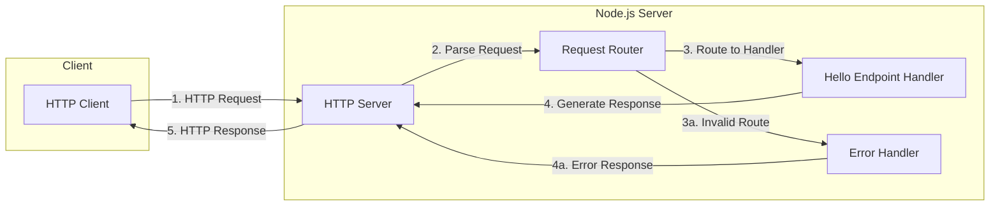
```mermaid
flowchart LR
    subgraph Client
        A[HTTP Client]
    end
    
    subgraph "Node.js Server"
        B[HTTP Server]
        C[Request Router]
        D[Hello Endpoint Handler]
        E[Error Handler]
    end
    
    A -->|1. HTTP Request| B
    B -->|2. Parse Request| C
    C -->|3. Route to Handler| D
    D -->|4. Generate Response| B
    C -->|3a. Invalid Route| E
    E -->|4a. Error Response| B
    B -->|5. HTTP Response| A
```

#### Detailed Process Flow for Hello Endpoint

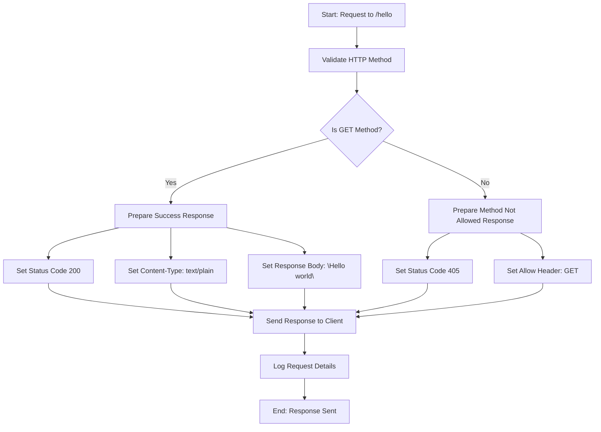
```mermaid
flowchart TD
    A[Start: Request to /hello] --> B[Validate HTTP Method]
    B --> C{Is GET Method?}
    C -->|Yes| D[Prepare Success Response]
    C -->|No| E[Prepare Method Not Allowed Response]
    
    D --> F[Set Status Code 200]
    D --> G[Set Content-Type: text/plain]
    D --> H["Set Response Body: \"Hello world\""]
    
    E --> I[Set Status Code 405]
    E --> J[Set Allow Header: GET]
    
    F --> K[Send Response to Client]
    G --> K
    H --> K
    I --> K
    J --> K
    
    K --> L[Log Request Details]
    L --> M[End: Response Sent]
```

#### Error Handling Flowchart

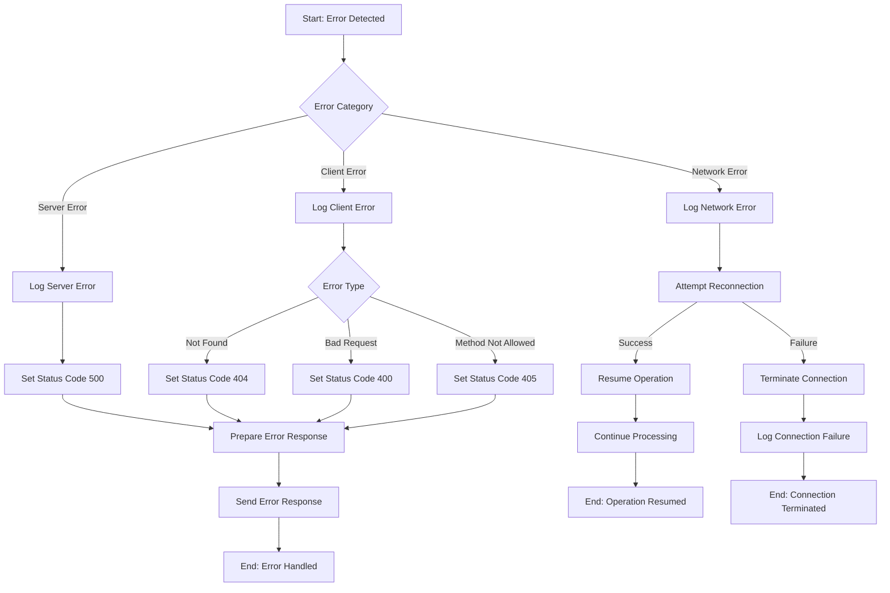
```mermaid
flowchart TD
    A[Start: Error Detected] --> B{Error Category}
    
    B -->|Server Error| C[Log Server Error]
    B -->|Client Error| D[Log Client Error]
    B -->|Network Error| E[Log Network Error]
    
    C --> F[Set Status Code 500]
    D --> G{Error Type}
    E --> H[Attempt Reconnection]
    
    G -->|Not Found| I[Set Status Code 404]
    G -->|Bad Request| J[Set Status Code 400]
    G -->|Method Not Allowed| K[Set Status Code 405]
    
    F --> L[Prepare Error Response]
    I --> L
    J --> L
    K --> L
    H -->|Success| M[Resume Operation]
    H -->|Failure| N[Terminate Connection]
    
    L --> O[Send Error Response]
    M --> P[Continue Processing]
    N --> Q[Log Connection Failure]
    
    O --> R[End: Error Handled]
    P --> S[End: Operation Resumed]
    Q --> T[End: Connection Terminated]
```

#### Integration Sequence Diagram

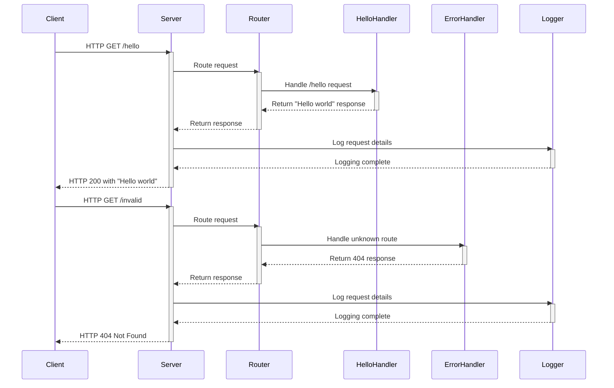
```mermaid
sequenceDiagram
    participant Client
    participant Server
    participant Router
    participant HelloHandler
    participant ErrorHandler
    participant Logger
    
    Client->>Server: HTTP GET /hello
    activate Server
    Server->>Router: Route request
    activate Router
    
    Router->>HelloHandler: Handle /hello request
    activate HelloHandler
    HelloHandler-->>Router: Return "Hello world" response
    deactivate HelloHandler
    
    Router-->>Server: Return response
    deactivate Router
    
    Server->>Logger: Log request details
    activate Logger
    Logger-->>Server: Logging complete
    deactivate Logger
    
    Server-->>Client: HTTP 200 with "Hello world"
    deactivate Server
    
    Client->>Server: HTTP GET /invalid
    activate Server
    Server->>Router: Route request
    activate Router
    
    Router->>ErrorHandler: Handle unknown route
    activate ErrorHandler
    ErrorHandler-->>Router: Return 404 response
    deactivate ErrorHandler
    
    Router-->>Server: Return response
    deactivate Router
    
    Server->>Logger: Log request details
    activate Logger
    Logger-->>Server: Logging complete
    deactivate Logger
    
    Server-->>Client: HTTP 404 Not Found
    deactivate Server
```

#### State Transition Diagram

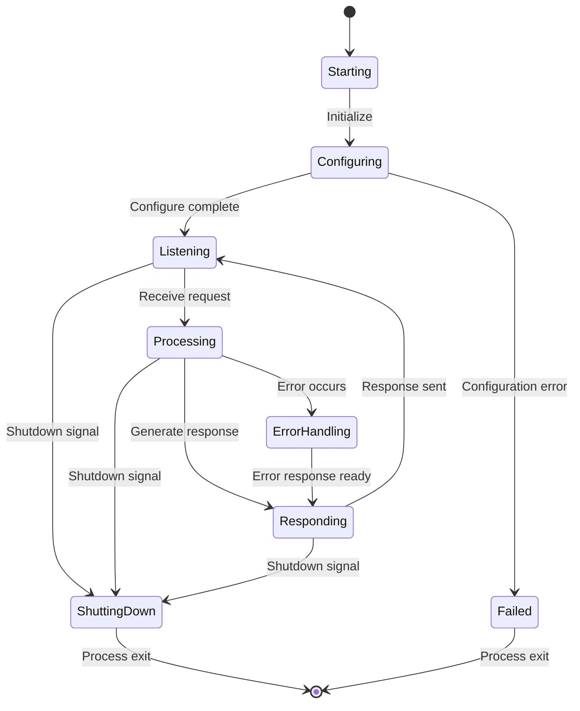
```mermaid
stateDiagram-v2
    [*] --> Starting
    Starting --> Configuring: Initialize
    Configuring --> Listening: Configure complete
    Configuring --> Failed: Configuration error
    
    Listening --> Processing: Receive request
    Processing --> Responding: Generate response
    Responding --> Listening: Response sent
    
    Processing --> ErrorHandling: Error occurs
    ErrorHandling --> Responding: Error response ready
    
    Listening --> ShuttingDown: Shutdown signal
    Processing --> ShuttingDown: Shutdown signal
    Responding --> ShuttingDown: Shutdown signal
    
    ShuttingDown --> [*]: Process exit
    Failed --> [*]: Process exit
```

## 5. SYSTEM ARCHITECTURE

### HIGH-LEVEL ARCHITECTURE

#### System Overview

The Node.js Hello World service follows a simple, monolithic architecture designed for educational purposes. The system employs:

- **Architectural Style**: Single-tier, standalone HTTP server architecture
- **Key Patterns**: Request-response pattern, middleware pattern (if using Express.js)
- **System Boundaries**: Self-contained Node.js process with HTTP interface
- **Major Interfaces**: Single REST endpoint exposed via HTTP

The architecture prioritizes simplicity and clarity over scalability or complex integrations, making it ideal for learning purposes. The system operates as a stateless service, processing each request independently without maintaining client session state.

#### Core Components Table

| Component Name | Primary Responsibility | Key Dependencies | Critical Considerations |
|----------------|------------------------|------------------|-------------------------|
| HTTP Server | Listen for and accept incoming HTTP connections | Node.js HTTP module | Port configuration, error handling |
| Request Router | Direct incoming requests to appropriate handler based on URL path | HTTP Server | Path matching logic, HTTP method validation |
| Hello Endpoint Handler | Process requests to `/hello` path and generate responses | Request Router | Response formatting, status code selection |
| Configuration Manager | Load and provide access to server configuration | Environment variables | Default values, validation |

#### Data Flow Description

The data flow in this system is straightforward:

1. The HTTP Server receives incoming HTTP requests from clients
2. Requests are parsed and validated for proper HTTP format
3. The Request Router examines the URL path to determine the appropriate handler
4. For `/hello` path requests, the Hello Endpoint Handler is invoked
5. The handler generates a text response with "Hello world" content
6. The response is sent back through the HTTP Server to the client

No data persistence is required as the system maintains no state between requests. All processing occurs in-memory without external data stores or caches.

#### External Integration Points

| System Name | Integration Type | Data Exchange Pattern | Protocol/Format |
|-------------|------------------|------------------------|-----------------|
| HTTP Clients | Consumer | Request-Response | HTTP/Plain Text |

### COMPONENT DETAILS

#### HTTP Server Component

- **Purpose**: Initialize and manage the HTTP server that listens for incoming client requests
- **Technologies**: Node.js built-in HTTP module or Express.js framework
- **Key Interfaces**: 
  - `listen(port)`: Starts the server on specified port
  - `close()`: Gracefully shuts down the server
- **Data Persistence**: None required
- **Scaling Considerations**: Single instance sufficient for educational purposes

#### Request Router Component

- **Purpose**: Examine incoming request URLs and route to appropriate handlers
- **Technologies**: URL parsing functionality from Node.js or Express routing
- **Key Interfaces**:
  - `route(request, response)`: Routes request to appropriate handler
- **Data Persistence**: None required
- **Scaling Considerations**: None for this simple implementation

#### Hello Endpoint Handler Component

- **Purpose**: Process requests to `/hello` endpoint and generate responses
- **Technologies**: JavaScript functions, HTTP response methods
- **Key Interfaces**:
  - `handleRequest(request, response)`: Processes request and sends response
- **Data Persistence**: None required
- **Scaling Considerations**: Stateless design requires no special scaling considerations

#### Configuration Manager Component

- **Purpose**: Load and provide access to server configuration settings
- **Technologies**: Node.js environment variables, JavaScript objects
- **Key Interfaces**:
  - `getPort()`: Returns configured port number
- **Data Persistence**: None required
- **Scaling Considerations**: None for this simple implementation

#### Component Interaction Diagram

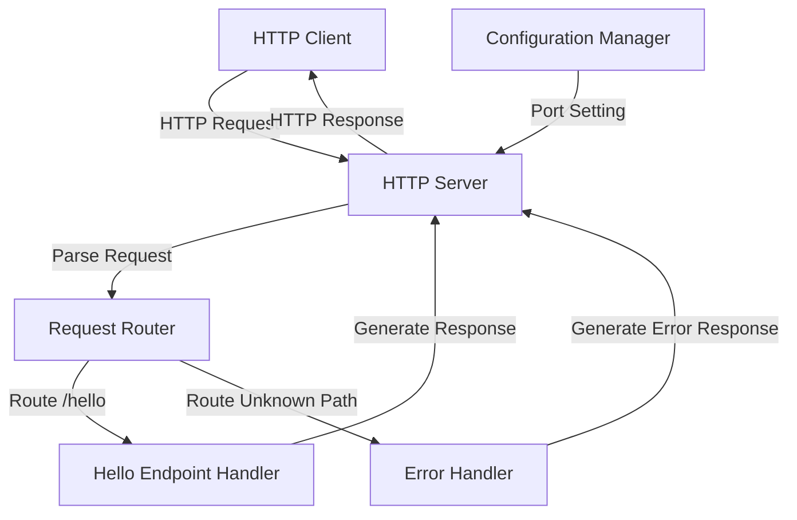
```mermaid
flowchart TD
    Client[HTTP Client] -->|HTTP Request| Server[HTTP Server]
    Server -->|Parse Request| Router[Request Router]
    Router -->|Route /hello| HelloHandler[Hello Endpoint Handler]
    Router -->|Route Unknown Path| ErrorHandler[Error Handler]
    Config[Configuration Manager] -->|Port Setting| Server
    HelloHandler -->|Generate Response| Server
    ErrorHandler -->|Generate Error Response| Server
    Server -->|HTTP Response| Client
```

#### Sequence Diagram for Hello Endpoint Request

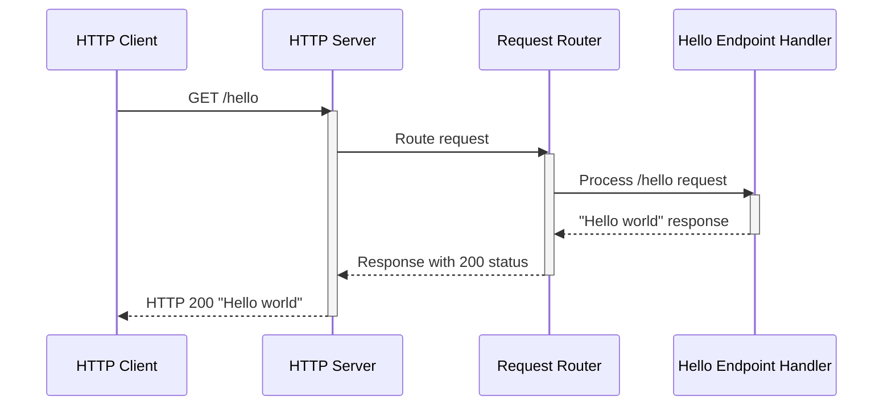
```mermaid
sequenceDiagram
    participant Client as HTTP Client
    participant Server as HTTP Server
    participant Router as Request Router
    participant Handler as Hello Endpoint Handler
    
    Client->>Server: GET /hello
    activate Server
    Server->>Router: Route request
    activate Router
    Router->>Handler: Process /hello request
    activate Handler
    Handler-->>Router: "Hello world" response
    deactivate Handler
    Router-->>Server: Response with 200 status
    deactivate Router
    Server-->>Client: HTTP 200 "Hello world"
    deactivate Server
```

#### State Transition Diagram for Request Processing

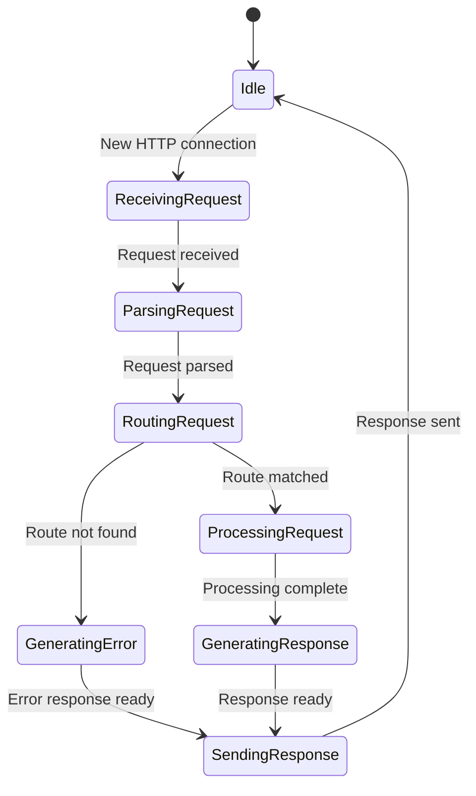
```mermaid
stateDiagram-v2
    [*] --> Idle
    Idle --> ReceivingRequest: New HTTP connection
    ReceivingRequest --> ParsingRequest: Request received
    ParsingRequest --> RoutingRequest: Request parsed
    RoutingRequest --> ProcessingRequest: Route matched
    RoutingRequest --> GeneratingError: Route not found
    ProcessingRequest --> GeneratingResponse: Processing complete
    GeneratingError --> SendingResponse: Error response ready
    GeneratingResponse --> SendingResponse: Response ready
    SendingResponse --> Idle: Response sent
```

### TECHNICAL DECISIONS

#### Architecture Style Decisions

| Decision | Selected Approach | Alternatives Considered | Rationale |
|----------|-------------------|-------------------------|-----------|
| Server Architecture | Single-process HTTP server | Microservices, Serverless | Simplicity and educational focus; minimal overhead for basic functionality |
| Framework Selection | Node.js HTTP module (or Express.js) | Koa, Hapi, Fastify | Native HTTP module provides direct access with no dependencies; Express optional for simplified routing |
| State Management | Stateless | Session-based, Database-backed | No need to maintain state between requests for this simple endpoint |

#### Communication Pattern Choices

| Pattern | Implementation | Rationale |
|---------|----------------|-----------|
| Request-Response | Synchronous HTTP | Standard web communication pattern, simple to implement and understand |
| Error Handling | HTTP status codes | Industry standard approach for communicating success/failure |
| Content Negotiation | Fixed content type (text/plain) | Simplifies implementation for educational purposes |

#### Architecture Decision Record: HTTP Framework Selection

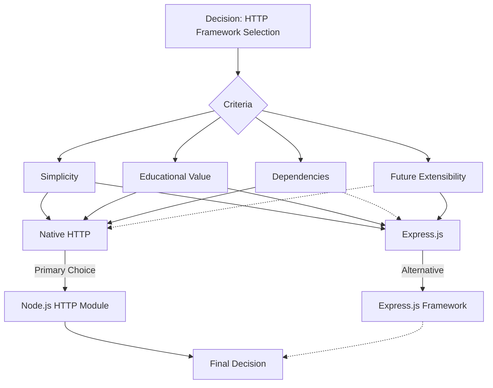
```mermaid
flowchart TD
    A[Decision: HTTP Framework Selection] --> B{Criteria}
    B --> C[Simplicity]
    B --> D[Educational Value]
    B --> E[Dependencies]
    B --> F[Future Extensibility]
    
    C --> G[Native HTTP]
    C --> H[Express.js]
    
    D --> G
    D --> H
    
    E --> G
    E -.-> H
    
    F -.-> G
    F --> H
    
    G -->|Primary Choice| I[Node.js HTTP Module]
    H -->|Alternative| J[Express.js Framework]
    
    I --> K[Final Decision]
    J -.-> K
```

### CROSS-CUTTING CONCERNS

#### Monitoring and Observability

For this simple educational application, monitoring is minimal:

- **Console Logging**: Server startup and request information logged to console
- **Error Reporting**: Uncaught exceptions logged to console
- **Health Checks**: None required for educational implementation

#### Logging Strategy

| Log Type | Implementation | Purpose |
|----------|----------------|---------|
| Startup Logs | Console output | Record server initialization and configuration |
| Request Logs | Console output | Track incoming requests and response status |
| Error Logs | Console output with stack traces | Capture and troubleshoot exceptions |

#### Error Handling Patterns

The application implements a simple error handling approach:

- **Server Startup Errors**: Log to console and exit process
- **Request Processing Errors**: Return appropriate HTTP status code
- **Uncaught Exceptions**: Global handler to prevent server crash

#### Error Handling Flow

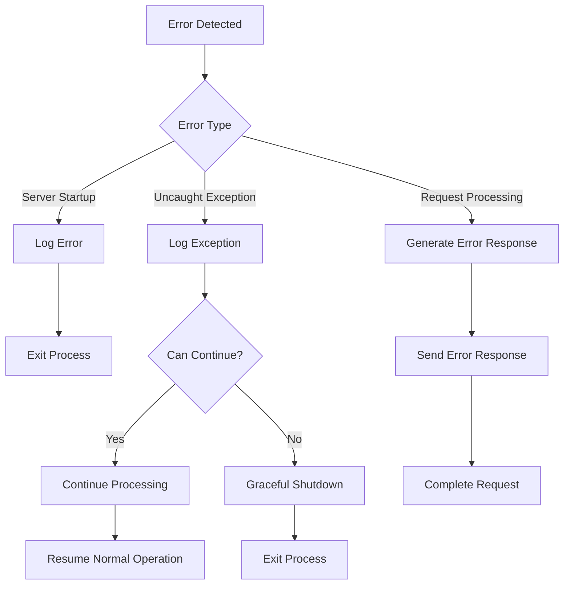
```mermaid
flowchart TD
    A[Error Detected] --> B{Error Type}
    B -->|Server Startup| C[Log Error]
    B -->|Request Processing| D[Generate Error Response]
    B -->|Uncaught Exception| E[Log Exception]
    
    C --> F[Exit Process]
    D --> G[Send Error Response]
    E --> H{Can Continue?}
    
    H -->|Yes| I[Continue Processing]
    H -->|No| J[Graceful Shutdown]
    
    G --> K[Complete Request]
    I --> L[Resume Normal Operation]
    J --> M[Exit Process]
```

#### Performance Requirements

For this educational application, performance requirements are minimal:

- **Response Time**: < 100ms for `/hello` endpoint
- **Throughput**: Sufficient for educational purposes
- **Resource Usage**: Minimal memory and CPU footprint

#### Security Considerations

Given the educational nature and limited functionality:

- **Input Validation**: Basic HTTP request validation
- **Output Encoding**: Plain text response requires no special encoding
- **No Authentication/Authorization**: Not required for this public endpoint

## 6. SYSTEM COMPONENTS DESIGN

### COMPONENT ARCHITECTURE

#### Component Breakdown

| Component | Type | Responsibility | Dependencies |
|-----------|------|----------------|--------------|
| Server | Core | Initialize HTTP server and handle lifecycle | Node.js HTTP module |
| Router | Core | Direct requests to appropriate handlers | Server component |
| HelloHandler | Feature | Process requests to `/hello` endpoint | Router component |
| ErrorHandler | Utility | Handle invalid routes and errors | Router component |
| ConfigManager | Utility | Manage server configuration | Environment variables |
| Logger | Utility | Log server events and requests | None |

#### Component Relationships

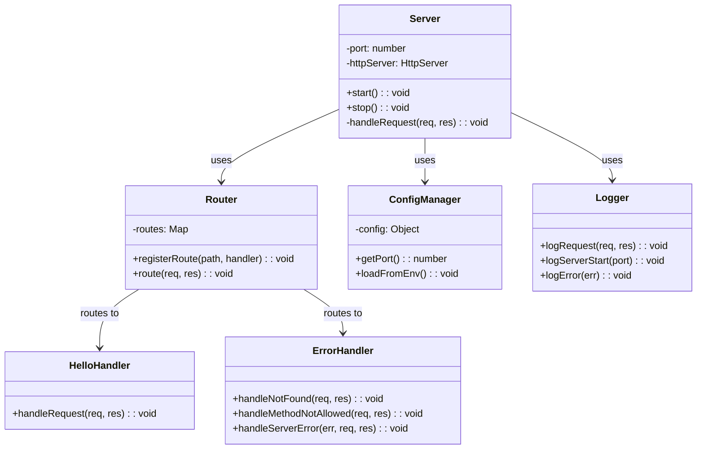
```mermaid
classDiagram
    class Server {
        -port: number
        -httpServer: HttpServer
        +start(): void
        +stop(): void
        -handleRequest(req, res): void
    }
    
    class Router {
        -routes: Map
        +registerRoute(path, handler): void
        +route(req, res): void
    }
    
    class HelloHandler {
        +handleRequest(req, res): void
    }
    
    class ErrorHandler {
        +handleNotFound(req, res): void
        +handleMethodNotAllowed(req, res): void
        +handleServerError(err, req, res): void
    }
    
    class ConfigManager {
        -config: Object
        +getPort(): number
        +loadFromEnv(): void
    }
    
    class Logger {
        +logRequest(req, res): void
        +logServerStart(port): void
        +logError(err): void
    }
    
    Server --> Router: uses
    Server --> ConfigManager: uses
    Server --> Logger: uses
    Router --> HelloHandler: routes to
    Router --> ErrorHandler: routes to
```

#### Component Interfaces

**Server Component Interface**

| Method | Parameters | Return Type | Description |
|--------|------------|-------------|-------------|
| start | None | Promise\<void\> | Initializes and starts the HTTP server |
| stop | None | Promise\<void\> | Gracefully shuts down the HTTP server |

**Router Component Interface**

| Method | Parameters | Return Type | Description |
|--------|------------|-------------|-------------|
| registerRoute | path: string, handler: Function | void | Registers a handler function for a specific path |
| route | req: HttpRequest, res: HttpResponse | void | Routes an incoming request to the appropriate handler |

**HelloHandler Component Interface**

| Method | Parameters | Return Type | Description |
|--------|------------|-------------|-------------|
| handleRequest | req: HttpRequest, res: HttpResponse | void | Processes requests to the `/hello` endpoint |

**ErrorHandler Component Interface**

| Method | Parameters | Return Type | Description |
|--------|------------|-------------|-------------|
| handleNotFound | req: HttpRequest, res: HttpResponse | void | Handles requests to non-existent routes |
| handleMethodNotAllowed | req: HttpRequest, res: HttpResponse | void | Handles requests with unsupported HTTP methods |
| handleServerError | err: Error, req: HttpRequest, res: HttpResponse | void | Handles server-side errors |

**ConfigManager Component Interface**

| Method | Parameters | Return Type | Description |
|--------|------------|-------------|-------------|
| getPort | None | number | Returns the configured port number |
| loadFromEnv | None | void | Loads configuration from environment variables |

**Logger Component Interface**

| Method | Parameters | Return Type | Description |
|--------|------------|-------------|-------------|
| logRequest | req: HttpRequest, res: HttpResponse | void | Logs information about an HTTP request and response |
| logServerStart | port: number | void | Logs server startup information |
| logError | err: Error | void | Logs error information |

### COMPONENT DESIGN DETAILS

#### Server Component

**Responsibilities:**
- Initialize and manage the HTTP server lifecycle
- Accept incoming HTTP connections
- Forward requests to the Router component
- Send responses back to clients
- Handle server startup and shutdown

**Internal Structure:**

```mermaid
classDiagram
    class Server {
        -port: number
        -httpServer: HttpServer
        -router: Router
        -configManager: ConfigManager
        -logger: Logger
        +constructor(router, configManager, logger)
        +start(): Promise~void~
        +stop(): Promise~void~
        -handleRequest(req, res): void
        -setupErrorHandling(): void
    }
```

**Key Behaviors:**
1. On initialization, loads configuration using ConfigManager
2. On start(), creates HTTP server instance and begins listening on configured port
3. For each incoming request, calls router.route() with request and response objects
4. Registers process-level error handlers to prevent crashes

#### Router Component

**Responsibilities:**
- Maintain registry of path-to-handler mappings
- Examine incoming request paths and methods
- Route requests to appropriate handlers
- Handle routing errors (path not found, method not allowed)

**Internal Structure:**

```mermaid
classDiagram
    class Router {
        -routes: Map~string, Object~
        -errorHandler: ErrorHandler
        +constructor(errorHandler)
        +registerRoute(path, method, handler): void
        +route(req, res): void
        -matchRoute(path, method): Object
    }
```

**Key Behaviors:**
1. Maintains a map of routes with path and HTTP method as keys
2. When route() is called, extracts path and method from request
3. Looks up appropriate handler based on path and method
4. If handler found, invokes it with request and response
5. If no handler found, delegates to errorHandler

#### HelloHandler Component

**Responsibilities:**
- Process requests to the `/hello` endpoint
- Generate "Hello world" responses
- Set appropriate headers and status codes

**Internal Structure:**

```mermaid
classDiagram
    class HelloHandler {
        -logger: Logger
        +constructor(logger)
        +handleRequest(req, res): void
        -validateMethod(method): boolean
    }
```

**Key Behaviors:**
1. Validates that the request uses the GET method
2. Sets response status code to 200 OK
3. Sets Content-Type header to text/plain
4. Writes "Hello world" to the response body
5. Logs the successful request handling

#### ErrorHandler Component

**Responsibilities:**
- Generate appropriate error responses
- Handle various error conditions (not found, method not allowed, server error)
- Set correct status codes and headers for error responses

**Internal Structure:**

```mermaid
classDiagram
    class ErrorHandler {
        -logger: Logger
        +constructor(logger)
        +handleNotFound(req, res): void
        +handleMethodNotAllowed(req, res): void
        +handleServerError(err, req, res): void
    }
```

**Key Behaviors:**
1. For not found errors, returns 404 status with appropriate message
2. For method not allowed errors, returns 405 status with Allow header
3. For server errors, returns 500 status and logs error details
4. All error responses include appropriate Content-Type headers

#### ConfigManager Component

**Responsibilities:**
- Load configuration from environment variables
- Provide access to configuration values
- Apply default values when configuration is missing

**Internal Structure:**

```mermaid
classDiagram
    class ConfigManager {
        -config: Object
        +constructor()
        +getPort(): number
        +loadFromEnv(): void
        -validatePort(port): number
    }
```

**Key Behaviors:**
1. On initialization, loads configuration from environment variables
2. Provides default port (3000) if not specified in environment
3. Validates configuration values (e.g., port is a valid number)
4. Exposes methods to access configuration values

#### Logger Component

**Responsibilities:**
- Log server events (startup, shutdown)
- Log request information
- Log errors with appropriate detail level

**Internal Structure:**

```mermaid
classDiagram
    class Logger {
        +constructor()
        +logRequest(req, res): void
        +logServerStart(port): void
        +logError(err): void
        -formatRequestLog(req, res): string
    }
```

**Key Behaviors:**
1. Formats log messages with timestamps and relevant context
2. For requests, logs HTTP method, path, status code, and response time
3. For errors, logs error message and stack trace
4. For server events, logs descriptive messages with relevant details

### COMPONENT INTERACTION SCENARIOS

#### Server Startup Sequence

```mermaid
sequenceDiagram
    participant Main
    participant ConfigManager
    participant Server
    participant Router
    participant HelloHandler
    participant Logger
    
    Main->>ConfigManager: new ConfigManager()
    Main->>Logger: new Logger()
    Main->>HelloHandler: new HelloHandler(logger)
    Main->>Router: new Router()
    Main->>Router: registerRoute("/hello", "GET", helloHandler)
    Main->>Server: new Server(router, configManager, logger)
    
    Main->>Server: start()
    activate Server
    Server->>ConfigManager: getPort()
    ConfigManager-->>Server: port (e.g., 3000)
    Server->>Server: Create HTTP server
    Server->>Logger: logServerStart(port)
    Server-->>Main: Server started
    deactivate Server
```

#### Hello Endpoint Request Processing

```mermaid
sequenceDiagram
    participant Client
    participant Server
    participant Router
    participant HelloHandler
    participant Logger
    
    Client->>Server: HTTP GET /hello
    activate Server
    Server->>Router: route(req, res)
    activate Router
    Router->>Router: matchRoute("/hello", "GET")
    Router->>HelloHandler: handleRequest(req, res)
    activate HelloHandler
    HelloHandler->>HelloHandler: validateMethod("GET")
    HelloHandler->>Logger: logRequest(req, res)
    HelloHandler-->>Router: Response prepared
    deactivate HelloHandler
    Router-->>Server: Request handled
    deactivate Router
    Server-->>Client: HTTP 200 "Hello world"
    deactivate Server
```

#### Error Handling: Invalid Path

```mermaid
sequenceDiagram
    participant Client
    participant Server
    participant Router
    participant ErrorHandler
    participant Logger
    
    Client->>Server: HTTP GET /invalid
    activate Server
    Server->>Router: route(req, res)
    activate Router
    Router->>Router: matchRoute("/invalid", "GET")
    Router->>ErrorHandler: handleNotFound(req, res)
    activate ErrorHandler
    ErrorHandler->>Logger: logRequest(req, res)
    ErrorHandler-->>Router: Error response prepared
    deactivate ErrorHandler
    Router-->>Server: Request handled
    deactivate Router
    Server-->>Client: HTTP 404 Not Found
    deactivate Server
```

#### Error Handling: Method Not Allowed

```mermaid
sequenceDiagram
    participant Client
    participant Server
    participant Router
    participant HelloHandler
    participant ErrorHandler
    participant Logger
    
    Client->>Server: HTTP POST /hello
    activate Server
    Server->>Router: route(req, res)
    activate Router
    Router->>Router: matchRoute("/hello", "POST")
    Router->>HelloHandler: handleRequest(req, res)
    activate HelloHandler
    HelloHandler->>HelloHandler: validateMethod("POST")
    HelloHandler->>ErrorHandler: handleMethodNotAllowed(req, res)
    activate ErrorHandler
    ErrorHandler->>Logger: logRequest(req, res)
    ErrorHandler-->>HelloHandler: Error response prepared
    deactivate ErrorHandler
    HelloHandler-->>Router: Request handled
    deactivate HelloHandler
    Router-->>Server: Request handled
    deactivate Router
    Server-->>Client: HTTP 405 Method Not Allowed
    deactivate Server
```

### COMPONENT DESIGN CONSIDERATIONS

#### Design Patterns

| Pattern | Application | Justification |
|---------|-------------|---------------|
| Dependency Injection | Component initialization | Improves testability by allowing mock dependencies |
| Facade | Server component | Simplifies the HTTP server interface for other components |
| Chain of Responsibility | Request routing | Allows flexible request handling based on path and method |
| Singleton | ConfigManager | Ensures consistent configuration throughout the application |

#### Error Handling Strategy

| Error Type | Handling Approach | Response |
|------------|-------------------|----------|
| Invalid Route | ErrorHandler.handleNotFound | 404 Not Found with text message |
| Invalid Method | ErrorHandler.handleMethodNotAllowed | 405 Method Not Allowed with Allow header |
| Server Error | ErrorHandler.handleServerError | 500 Internal Server Error with generic message |
| Startup Error | Process termination with error code | Console error message |

**Error Propagation Flow:**

```mermaid
flowchart TD
    A[Error Detected] --> B{Error Location}
    B -->|Component| C[Component handles locally]
    B -->|Cross-component| D[Propagate to caller]
    B -->|Unhandled| E[Global error handler]
    
    C --> F{Can resolve?}
    F -->|Yes| G[Handle and continue]
    F -->|No| D
    
    D --> H{Server component?}
    H -->|Yes| I[Convert to HTTP error]
    H -->|No| J[Propagate up]
    
    E --> K[Log error]
    K --> L[Determine severity]
    L -->|Critical| M[Terminate process]
    L -->|Non-critical| N[Continue operation]
    
    I --> O[Send error response]
    J --> E
    G --> P[Operation continues]
    O --> P
    N --> P
    M --> Q[Process exits]
```

#### Performance Considerations

| Component | Performance Consideration | Mitigation Strategy |
|-----------|---------------------------|---------------------|
| Server | Connection handling | Use Node.js asynchronous I/O model |
| Router | Route lookup efficiency | Use Map data structure for O(1) lookups |
| HelloHandler | Response generation | Minimize processing logic |
| Logger | I/O overhead | Asynchronous logging, minimal production logging |

#### Security Considerations

| Component | Security Consideration | Mitigation Strategy |
|-----------|------------------------|---------------------|
| Server | Denial of Service | Timeout handling, request size limits |
| Router | Path traversal | Strict path matching, no file system access |
| HelloHandler | Input validation | Validate HTTP method |
| ConfigManager | Environment security | No sensitive data in configuration |

### COMPONENT TESTING STRATEGY

#### Unit Testing Approach

| Component | Test Focus | Mock Dependencies |
|-----------|------------|-------------------|
| Server | Lifecycle management, request handling | Router, ConfigManager, HTTP module |
| Router | Route registration, request routing | ErrorHandler |
| HelloHandler | Response generation, method validation | None |
| ErrorHandler | Error response generation | None |
| ConfigManager | Configuration loading, validation | Environment variables |
| Logger | Log formatting | Console output |

#### Integration Testing Approach

| Test Scenario | Components Involved | Test Approach |
|---------------|---------------------|--------------|
| Server Startup | Server, ConfigManager, Router | Verify server starts on correct port |
| Request Handling | Server, Router, HelloHandler | Send request to `/hello` and verify response |
| Error Handling | Server, Router, ErrorHandler | Send requests to invalid paths and verify responses |
| Method Validation | Server, Router, HelloHandler, ErrorHandler | Send non-GET requests to `/hello` and verify responses |

#### Component Test Cases

**Server Component Tests:**

1. Server starts successfully with default port
2. Server starts successfully with custom port
3. Server handles request and routes to Router
4. Server gracefully shuts down

**Router Component Tests:**

1. Router registers route successfully
2. Router routes request to correct handler
3. Router handles unknown path
4. Router handles unsupported method

**HelloHandler Component Tests:**

1. Handler returns "Hello world" for GET request
2. Handler sets correct Content-Type header
3. Handler returns 405 for non-GET requests

**ErrorHandler Component Tests:**

1. Not Found handler returns 404 status
2. Method Not Allowed handler returns 405 status with Allow header
3. Server Error handler returns 500 status

**ConfigManager Component Tests:**

1. Returns default port when environment variable not set
2. Returns port from environment variable when set
3. Validates port number is within valid range

**Logger Component Tests:**

1. Formats request log correctly
2. Formats error log with stack trace
3. Formats server start log with port number

### 6.1 CORE SERVICES ARCHITECTURE

Core Services Architecture is not applicable for this system in its traditional sense. This Node.js Hello World application is intentionally designed as a monolithic, single-service application to serve educational purposes with minimal complexity. The application does not require microservices, distributed architecture, or distinct service components for the following reasons:

1. **Minimal Functionality**: The application only provides a single `/hello` endpoint with static response text.
2. **Educational Purpose**: The primary goal is to demonstrate basic HTTP server concepts in Node.js.
3. **No Complex Business Logic**: There are no distinct business domains that would benefit from service separation.
4. **No Scalability Requirements**: The application is designed for learning, not for production-level traffic.

However, we can describe the simplified architecture and how it could evolve if requirements changed:

#### SIMPLIFIED SERVICE ARCHITECTURE

```mermaid
flowchart TD
    Client[HTTP Client] -->|Request| Server[Node.js HTTP Server]
    Server -->|Response| Client
    
    subgraph "Node.js Process"
        Server --> Router[Request Router]
        Router --> HelloHandler[Hello Endpoint Handler]
        Router --> ErrorHandler[Error Handler]
        ConfigManager[Configuration Manager] --> Server
    end
```

#### POTENTIAL EVOLUTION CONSIDERATIONS

While the current implementation doesn't require a complex service architecture, here are considerations for potential evolution:

| Evolution Aspect | Current Approach | Potential Future Approach |
|------------------|------------------|---------------------------|
| Service Scaling | Single process | Horizontal scaling with load balancer |
| Resilience | Basic error handling | Health checks, circuit breakers |
| Service Discovery | Not applicable | Service registry if multiple services emerge |

#### SIMPLIFIED SCALING APPROACH

For the current implementation, scaling is straightforward:

| Scaling Dimension | Approach | Implementation |
|-------------------|----------|----------------|
| Vertical Scaling | Increase resources | Allocate more CPU/memory to Node.js process |
| Horizontal Scaling | Multiple instances | Run multiple instances behind a load balancer |
| Process Management | Single process | Use PM2 or similar for process management |

```mermaid
flowchart TD
    Client[HTTP Clients] -->|Requests| LB[Load Balancer]
    
    LB -->|Route Request| S1[Server Instance 1]
    LB -->|Route Request| S2[Server Instance 2]
    LB -->|Route Request| S3[Server Instance 3]
    
    subgraph "Potential Horizontal Scaling"
        S1
        S2
        S3
    end
```

#### SIMPLIFIED RESILIENCE APPROACH

For educational purposes, the current implementation includes basic error handling. In a more robust implementation:

| Resilience Aspect | Current Approach | Enhanced Approach |
|-------------------|------------------|-------------------|
| Error Handling | Basic try/catch | Structured error handling with recovery |
| Process Crashes | None | Process manager (PM2) for auto-restart |
| Monitoring | Console logs | Health endpoints and monitoring tools |

```mermaid
flowchart TD
    A[Process Manager] -->|Monitors| B[Node.js Process]
    B -->|Crashes| C{Detect Failure}
    C -->|Restart| B
    
    subgraph "Basic Resilience Pattern"
        A
        B
        C
    end
```

#### IMPLEMENTATION NOTES

For the current Hello World application:

1. **Process Management**: Consider using a process manager like PM2 even in development to handle crashes.
2. **Error Handling**: Implement global error handlers to prevent unhandled exceptions from crashing the server.
3. **Configuration**: Use environment variables for basic configuration to support different environments.

This simplified approach maintains the educational value while introducing concepts that would be relevant in more complex systems.

## 6.2 DATABASE DESIGN

Database Design is not applicable to this system. The Node.js Hello World application with a single `/hello` endpoint that returns "Hello world" does not require any persistent data storage for the following reasons:

1. **Stateless Operation**: The application functions as a stateless service that generates the same response for all requests to the `/hello` endpoint without needing to store or retrieve any data.

2. **No Dynamic Content**: The response "Hello world" is static and hardcoded, requiring no database lookups or persistent storage.

3. **No User Data**: The application does not collect, process, or store any user information that would require persistence.

4. **No Configuration Storage**: While the application may use environment variables for configuration (such as port number), these are managed by the runtime environment rather than a database.

5. **No Logging Database**: While the application may generate logs, these are typically written to the console or files rather than a database in this minimal implementation.

### Alternative Approaches for Future Extensions

If the application were to be extended beyond its current scope, the following database approaches might become relevant:

| Extension Scenario | Potential Database Approach |
|--------------------|----------------------------|
| User authentication | User database with credentials |
| Request logging | Time-series database or log storage |
| Dynamic responses | Content database with templates |
| Rate limiting | Cache or key-value store for counters |

### Data Flow in Current Implementation

```mermaid
flowchart LR
    Client[HTTP Client] -->|Request| Server[Node.js Server]
    Server -->|"Hello world" Response| Client
    
    subgraph "Node.js Process"
        Server -->|Process Request| Handler[Request Handler]
        Handler -->|Generate Response| Server
    end
```

The current implementation maintains all necessary state within the application's memory during request processing, with no persistence between requests or application restarts.

### 6.3 INTEGRATION ARCHITECTURE

Integration Architecture is not applicable for this system in its traditional sense. The Node.js Hello World application with a single `/hello` endpoint is intentionally designed as a standalone, self-contained service with minimal complexity for educational purposes. The application does not require integration with external systems or services for the following reasons:

1. **Minimal Functionality**: The application only provides a single `/hello` endpoint with a static "Hello world" response.
2. **Educational Purpose**: The primary goal is to demonstrate basic HTTP server concepts in Node.js.
3. **No External Dependencies**: The application functions independently without requiring data or services from external systems.
4. **No Authentication Requirements**: The endpoint is designed to be publicly accessible without authentication.
5. **No Complex Data Processing**: There is no need for message queues, event processing, or batch operations.

However, we can document the simplified API design that this application implements, which could serve as a foundation for future extensions:

#### SIMPLIFIED API DESIGN

| Aspect | Implementation |
|--------|----------------|
| Protocol | HTTP/1.1 |
| Endpoint | `/hello` |
| Method | GET |
| Response Format | Plain text |
| Status Codes | 200 OK (success), 404 Not Found (invalid path), 405 Method Not Allowed (invalid method) |

#### API REQUEST-RESPONSE FLOW

```mermaid
sequenceDiagram
    participant Client as HTTP Client
    participant Server as Node.js Server
    
    Client->>Server: HTTP GET /hello
    Server-->>Client: HTTP 200 "Hello world"
    
    Client->>Server: HTTP GET /invalid-path
    Server-->>Client: HTTP 404 Not Found
    
    Client->>Server: HTTP POST /hello
    Server-->>Client: HTTP 405 Method Not Allowed
```

#### SIMPLIFIED API ARCHITECTURE

```mermaid
flowchart TD
    Client[HTTP Client] -->|Request| Server[Node.js HTTP Server]
    
    subgraph "Node.js Process"
        Server --> Router[Request Router]
        Router -->|GET /hello| HelloHandler[Hello Endpoint Handler]
        Router -->|Other paths| NotFoundHandler[Not Found Handler]
        HelloHandler -->|Non-GET methods| MethodNotAllowedHandler[Method Not Allowed Handler]
    end
    
    HelloHandler -->|"Hello world"| Server
    NotFoundHandler -->|404 Response| Server
    MethodNotAllowedHandler -->|405 Response| Server
    
    Server -->|Response| Client
```

#### POTENTIAL FUTURE INTEGRATION CONSIDERATIONS

If the application were to evolve beyond its current educational scope, the following integration aspects might become relevant:

| Integration Aspect | Current State | Potential Future Implementation |
|-------------------|---------------|--------------------------------|
| Authentication | None required | JWT or API key authentication |
| Rate Limiting | Not implemented | Token bucket algorithm with Redis |
| API Versioning | Not applicable | URL path versioning (e.g., `/v1/hello`) |
| Documentation | README file | OpenAPI/Swagger specification |
| External Services | None | Database integration, third-party APIs |

#### IMPLEMENTATION NOTES FOR CURRENT DESIGN

For the current Hello World application:

1. **Content Type Header**: The response should include `Content-Type: text/plain` header.
2. **CORS Headers**: For educational purposes, consider adding basic CORS headers to allow browser clients.
3. **Error Handling**: Implement appropriate error responses for invalid paths and methods.

```mermaid
flowchart LR
    Client[HTTP Client] -->|GET /hello| Server[Node.js Server]
    Server -->|Process Request| Handler[Request Handler]
    Handler -->|Generate Response| ResponseBuilder[Response Builder]
    ResponseBuilder -->|Set Headers| ResponseBuilder
    ResponseBuilder -->|Set Status Code| ResponseBuilder
    ResponseBuilder -->|Set Body| ResponseBuilder
    ResponseBuilder -->|"HTTP 200 'Hello world'"| Server
    Server -->|Response| Client
```

This simplified approach maintains the educational value while introducing concepts that would be relevant in more complex systems with actual integration requirements.

### 6.4 SECURITY ARCHITECTURE

Detailed Security Architecture is not applicable for this system. The Node.js Hello World application with a single `/hello` endpoint that returns "Hello world" is intentionally designed as a minimal educational example with no authentication, authorization, or sensitive data handling requirements.

#### STANDARD SECURITY PRACTICES

Despite the minimal nature of this application, the following standard security practices will be implemented:

| Security Practice | Implementation Approach | Purpose |
|-------------------|-------------------------|---------|
| Input Validation | Validate HTTP method and path | Prevent unexpected behavior from malformed requests |
| Error Handling | Custom error responses | Avoid leaking system information in error messages |
| Headers Security | Set appropriate security headers | Enhance client-side security posture |
| Dependency Management | Regular updates of Node.js | Mitigate known vulnerabilities in the runtime |

#### SIMPLIFIED SECURITY MODEL

```mermaid
flowchart TD
    Client[HTTP Client] -->|Request| Server[Node.js Server]
    
    subgraph "Security Controls"
        Server --> RequestValidation[Request Validation]
        RequestValidation --> MethodValidation[HTTP Method Validation]
        RequestValidation --> PathValidation[URL Path Validation]
        
        MethodValidation -->|Valid| ResponseGeneration[Response Generation]
        PathValidation -->|Valid| ResponseGeneration
        
        MethodValidation -->|Invalid| ErrorHandler[Error Handler]
        PathValidation -->|Invalid| ErrorHandler
        
        ResponseGeneration --> HeaderSecurity[Security Headers]
    end
    
    HeaderSecurity --> Server
    ErrorHandler --> Server
    Server -->|Response| Client
```

#### SECURITY HEADERS

Although this is a simple application, implementing security headers is a good practice:

| Header | Value | Purpose |
|--------|-------|---------|
| X-Content-Type-Options | nosniff | Prevent MIME type sniffing |
| X-Frame-Options | DENY | Prevent clickjacking attacks |
| Content-Security-Policy | default-src 'self' | Mitigate XSS attacks |
| Cache-Control | no-store | Prevent sensitive data caching |

#### ERROR HANDLING SECURITY

Proper error handling helps prevent information disclosure:

| Error Scenario | Response | Security Benefit |
|----------------|----------|------------------|
| Invalid Path | 404 Not Found | Hide implementation details |
| Invalid Method | 405 Method Not Allowed | Restrict to intended usage |
| Server Error | 500 Internal Server Error | Hide stack traces and errors |

#### DEPLOYMENT SECURITY CONSIDERATIONS

When deploying this application, consider these basic security practices:

| Deployment Aspect | Security Practice | Benefit |
|-------------------|-------------------|---------|
| Node.js Version | Use LTS versions | Receive security updates |
| Dependencies | Minimize dependencies | Reduce attack surface |
| Process Isolation | Run with limited privileges | Limit impact of compromise |
| Network Exposure | Restrict to needed ports | Reduce attack surface |

#### SECURITY MONITORING

Even for this simple application, basic monitoring helps maintain security:

```mermaid
flowchart LR
    Server[Node.js Server] -->|Logs| ConsoleOutput[Console Output]
    
    subgraph "Basic Monitoring"
        ConsoleOutput --> RequestLogs[Request Logs]
        ConsoleOutput --> ErrorLogs[Error Logs]
        ConsoleOutput --> StartupLogs[Startup Logs]
    end
    
    RequestLogs -->|Review| SecurityMonitoring[Security Monitoring]
    ErrorLogs -->|Review| SecurityMonitoring
    StartupLogs -->|Review| SecurityMonitoring
```

#### FUTURE SECURITY CONSIDERATIONS

If this application were to evolve beyond its educational purpose, the following security enhancements should be considered:

| Security Area | Current State | Future Consideration |
|---------------|---------------|----------------------|
| Authentication | Not implemented | API keys or JWT authentication |
| Rate Limiting | Not implemented | Request throttling to prevent DoS |
| Input Validation | Basic method validation | Comprehensive request validation |
| Logging | Console logging | Structured logging with security events |
| HTTPS | Not required | TLS implementation for production |

This simplified approach maintains the educational value of the application while acknowledging security best practices that would be relevant in more complex systems.

### 6.5 MONITORING AND OBSERVABILITY

Detailed Monitoring Architecture is not applicable for this system. The Node.js Hello World application with a single `/hello` endpoint is intentionally designed as a minimal educational example that does not require comprehensive monitoring infrastructure or complex observability patterns.

However, even for educational purposes, implementing basic monitoring practices provides valuable learning opportunities and establishes good habits for production applications. The following basic monitoring and observability practices will be implemented:

#### BASIC MONITORING APPROACH

| Monitoring Aspect | Implementation | Purpose |
|-------------------|----------------|---------|
| Console Logging | Built-in Node.js console | Track server startup, requests, and errors |
| Process Monitoring | Basic health endpoint | Allow external systems to verify service availability |
| Error Tracking | Global error handlers | Capture and log unhandled exceptions |

#### SIMPLIFIED MONITORING ARCHITECTURE

```mermaid
flowchart TD
    Client[HTTP Client] -->|Request| Server[Node.js Server]
    Server -->|Response| Client
    
    subgraph "Basic Monitoring"
        Server -->|Logs| ConsoleOutput[Console Output]
        Server -->|Metrics| HealthEndpoint[Health Endpoint]
        Server -->|Errors| ErrorHandler[Error Handler]
    end
    
    ExternalMonitor[External Monitor] -->|Periodic Check| HealthEndpoint
```

#### HEALTH CHECK IMPLEMENTATION

A simple health check endpoint will be added to verify the service is operational:

| Endpoint | Method | Response | Purpose |
|----------|--------|----------|---------|
| `/health` | GET | 200 OK with uptime | Verify server is running and responsive |

```mermaid
sequenceDiagram
    participant Monitor as Monitoring Tool
    participant Server as Node.js Server
    
    Monitor->>Server: GET /health
    Server-->>Monitor: 200 OK {"status":"up","uptime":"10m"}
```

#### BASIC LOGGING STRATEGY

| Log Type | Information Captured | Format |
|----------|----------------------|--------|
| Startup Logs | Server start time, port, Node.js version | Text with timestamp |
| Request Logs | Method, path, status code, response time | Text with timestamp |
| Error Logs | Error message, stack trace, request context | Text with timestamp |

#### SIMPLIFIED LOG FLOW

```mermaid
flowchart LR
    Server[Node.js Server] -->|Generate Logs| ConsoleOutput[Console Output]
    
    subgraph "Log Categories"
        ConsoleOutput --> StartupLogs[Startup Logs]
        ConsoleOutput --> RequestLogs[Request Logs]
        ConsoleOutput --> ErrorLogs[Error Logs]
    end
    
    subgraph "Optional Extensions"
        ConsoleOutput -.->|Redirect| FileSystem[Log Files]
        FileSystem -.->|Rotate| LogRotation[Log Rotation]
    end
```

#### BASIC METRICS COLLECTION

For educational purposes, the following basic metrics will be tracked:

| Metric | Description | Collection Method |
|--------|-------------|-------------------|
| Request Count | Total number of requests received | In-memory counter |
| Response Time | Time to process requests | Timing in request handler |
| Error Count | Number of requests resulting in errors | In-memory counter |
| Uptime | Time since server started | Server start timestamp |

#### SIMPLIFIED DASHBOARD CONCEPT

```mermaid
flowchart TD
    subgraph "Basic Dashboard"
        A[Server Status: UP]
        B[Uptime: 1d 2h 34m]
        C[Total Requests: 1,234]
        D[Error Rate: 0.1%]
    end
    
    subgraph "Request Metrics"
        E[Requests/Minute: 10]
        F[Avg Response Time: 5ms]
        G[Max Response Time: 20ms]
        H["Status Codes: 200: 1,230 | 404: 3 | 500: 1"]
    end
```

#### FUTURE MONITORING CONSIDERATIONS

If this application were to evolve beyond its educational purpose, the following monitoring enhancements should be considered:

| Monitoring Area | Current State | Future Consideration |
|-----------------|---------------|----------------------|
| Metrics Collection | In-memory counters | Prometheus integration |
| Log Management | Console output | ELK stack or cloud logging service |
| Alerting | Not implemented | Alert manager with notification channels |
| Dashboards | Not implemented | Grafana dashboards |
| Distributed Tracing | Not applicable | OpenTelemetry integration |

#### IMPLEMENTATION RECOMMENDATIONS

For the current Hello World application:

1. **Structured Logging**: Use a simple format with timestamp, log level, and message
2. **Health Endpoint**: Implement a basic `/health` endpoint returning server status
3. **Request Logging Middleware**: Log each request with method, path, status, and duration
4. **Error Handling**: Implement global error handler to catch and log unhandled exceptions

```mermaid
flowchart TD
    A[Incoming Request] --> B[Request Logging Middleware]
    B --> C{Route Matching}
    C -->|/hello| D[Hello Handler]
    C -->|/health| E[Health Check Handler]
    C -->|Other| F[Not Found Handler]
    
    D --> G[Response Logging Middleware]
    E --> G
    F --> G
    
    subgraph "Error Handling"
        D -.->|Exception| H[Global Error Handler]
        E -.->|Exception| H
        H --> G
    end
    
    G --> I[Response Sent]
```

This simplified approach maintains the educational value of the application while introducing basic monitoring concepts that would be relevant in more complex systems.

## 6.6 TESTING STRATEGY

While this Node.js Hello World application is intentionally minimal, implementing a structured testing approach provides valuable learning opportunities and ensures the application functions as expected. The testing strategy will focus on essential testing practices appropriate for a simple HTTP server with a single endpoint.

### TESTING APPROACH

#### Unit Testing

| Aspect | Implementation |
|--------|----------------|
| Testing Framework | Jest |
| Test Structure | Tests organized by component (server, router, handler) |
| Mocking Strategy | HTTP requests/responses mocked with supertest |
| Code Coverage | 80% minimum coverage for all components |

**Test Organization Structure:**

```
/tests
  /unit
    server.test.js
    router.test.js
    helloHandler.test.js
    errorHandler.test.js
  /integration
    hello-endpoint.test.js
```

**Mocking Strategy:**

```mermaid
flowchart TD
    A[Test Case] --> B[Mock HTTP Request]
    B --> C[Call Handler Function]
    C --> D[Mock HTTP Response]
    D --> E[Assert Response Properties]
    
    subgraph "Unit Test Flow"
        B
        C
        D
        E
    end
```

**Test Naming Conventions:**

| Pattern | Example |
|---------|---------|
| `describe('Component')` | `describe('HelloHandler')` |
| `describe('method()')` | `describe('handleRequest()')` |
| `it('should do something')` | `it('should return Hello world')` |

**Example Unit Test Pattern:**

```
describe('HelloHandler', () => {
  describe('handleRequest()', () => {
    it('should return Hello world with 200 status', () => {
      // Test implementation
    });
    
    it('should return 405 for non-GET methods', () => {
      // Test implementation
    });
  });
});
```

#### Integration Testing

| Aspect | Implementation |
|--------|----------------|
| API Testing | Supertest to make HTTP requests to running server |
| Test Scope | Full request-response cycle for all endpoints |
| Environment | Local test environment with isolated port |

**Integration Test Flow:**

```mermaid
flowchart TD
    A[Start Test Server] --> B[Send HTTP Request]
    B --> C[Receive HTTP Response]
    C --> D[Assert Response Properties]
    D --> E[Stop Test Server]
    
    subgraph "Integration Test Flow"
        A
        B
        C
        D
        E
    end
```

**Example Integration Test Pattern:**

```
describe('Hello Endpoint', () => {
  let server;
  
  beforeEach(() => {
    server = app.listen(3001);
  });
  
  afterEach(() => {
    server.close();
  });
  
  it('should return Hello world for GET /hello', async () => {
    // Test implementation using supertest
  });
});
```

#### End-to-End Testing

For this simple application, comprehensive E2E testing is not required. However, basic E2E tests will be implemented to verify the server functions correctly in a real environment.

| Aspect | Implementation |
|--------|----------------|
| Test Scenarios | Server startup, endpoint accessibility |
| Approach | HTTP client (axios/fetch) making real requests |
| Environment | Local server on test port |

**E2E Test Flow:**

```mermaid
flowchart TD
    A[Start Server Process] --> B[Wait for Server Ready]
    B --> C[Send HTTP Request]
    C --> D[Verify Response]
    D --> E[Shutdown Server]
    
    subgraph "E2E Test Flow"
        A
        B
        C
        D
        E
    end
```

### TEST AUTOMATION

| Aspect | Implementation |
|--------|----------------|
| CI Integration | GitHub Actions for automated testing |
| Test Triggers | On pull request and push to main branch |
| Test Reporting | Jest HTML reporter for test results |

**CI/CD Test Flow:**

```mermaid
flowchart TD
    A[Code Push] --> B[GitHub Actions Triggered]
    B --> C[Install Dependencies]
    C --> D[Run Linting]
    D --> E[Run Unit Tests]
    E --> F[Run Integration Tests]
    F --> G{All Tests Pass?}
    G -->|Yes| H[Build Success]
    G -->|No| I[Build Failure]
    
    subgraph "CI Pipeline"
        B
        C
        D
        E
        F
        G
        H
        I
    end
```

**Test Execution Strategy:**

| Test Type | When Executed | Environment |
|-----------|---------------|-------------|
| Unit Tests | Pre-commit, CI pipeline | Local, CI |
| Integration Tests | CI pipeline | CI |
| E2E Tests | CI pipeline (main branch only) | CI |

### QUALITY METRICS

| Metric | Target |
|--------|--------|
| Code Coverage | 80% minimum (statements, branches, functions) |
| Test Success Rate | 100% passing tests required for merge |
| Documentation | All components and tests must be documented |

**Code Coverage Requirements:**

| Component | Coverage Target |
|-----------|----------------|
| Server | 80% |
| Router | 90% |
| Handlers | 100% |
| Error Handling | 90% |

### TEST ENVIRONMENT

```mermaid
flowchart TD
    subgraph "Test Environments"
        A[Local Development]
        B[CI Environment]
    end
    
    subgraph "Local Testing"
        C[Unit Tests]
        D[Integration Tests]
        E[Manual Testing]
    end
    
    subgraph "CI Testing"
        F[Automated Unit Tests]
        G[Automated Integration Tests]
        H[Code Coverage Analysis]
    end
    
    A --> C
    A --> D
    A --> E
    
    B --> F
    B --> G
    B --> H
```

### TEST DATA MANAGEMENT

For this simple application, test data management is minimal:

| Test Type | Test Data Approach |
|-----------|-------------------|
| Unit Tests | In-memory mocks of request/response objects |
| Integration Tests | HTTP requests with predefined payloads |

### TESTING TOOLS

| Tool | Purpose | Implementation |
|------|---------|----------------|
| Jest | Test framework | Primary test runner and assertion library |
| Supertest | HTTP testing | Testing API endpoints without network calls |
| Istanbul/nyc | Code coverage | Measuring test coverage metrics |
| ESLint | Code quality | Enforcing code standards |

### EXAMPLE TEST SCENARIOS

#### Unit Test Scenarios

| Component | Test Scenario | Expected Outcome |
|-----------|--------------|------------------|
| HelloHandler | GET request to /hello | Returns "Hello world" with 200 status |
| HelloHandler | POST request to /hello | Returns 405 Method Not Allowed |
| Router | Request to unknown path | Routes to error handler |
| ErrorHandler | Handle 404 error | Returns appropriate error response |

#### Integration Test Scenarios

| Endpoint | Test Scenario | Expected Outcome |
|----------|--------------|------------------|
| /hello | GET request | 200 status with "Hello world" body |
| /hello | POST request | 405 status with Allow header |
| /invalid | GET request | 404 status with error message |
| /health | GET request | 200 status with uptime information |

### TEST EXECUTION FLOW

```mermaid
flowchart TD
    A[Developer Writes Code] --> B[Run Unit Tests Locally]
    B -->|Pass| C[Commit and Push]
    B -->|Fail| A
    
    C --> D[CI Pipeline Triggered]
    D --> E[Run Linting]
    E --> F[Run Unit Tests]
    F --> G[Run Integration Tests]
    G --> H[Generate Coverage Report]
    
    H --> I{Coverage >= 80%?}
    I -->|Yes| J{All Tests Pass?}
    I -->|No| K[Coverage Failure]
    
    J -->|Yes| L[Build Success]
    J -->|No| M[Test Failure]
    
    K --> N[Developer Fixes]
    M --> N
    N --> A
```

### SECURITY TESTING

Even for this simple application, basic security testing will be implemented:

| Security Test | Implementation | Purpose |
|---------------|----------------|---------|
| HTTP Headers | Verify security headers | Ensure proper security headers are set |
| Input Validation | Test with malformed requests | Verify proper handling of invalid input |
| Error Exposure | Check error responses | Ensure no sensitive information is leaked |

### PERFORMANCE TESTING

Basic performance testing will be conducted to ensure the application meets minimal performance requirements:

| Test Type | Tool | Metrics |
|-----------|------|---------|
| Load Testing | autocannon | Response time under load |
| Throughput | autocannon | Requests per second |

**Performance Test Flow:**

```mermaid
flowchart TD
    A[Start Server] --> B[Run Baseline Test]
    B --> C[Record Baseline Metrics]
    C --> D[Run Load Test]
    D --> E[Compare with Baseline]
    E --> F[Generate Performance Report]
```

### TESTING CHALLENGES AND MITIGATIONS

| Challenge | Mitigation Strategy |
|-----------|---------------------|
| Test Isolation | Use unique ports for each test run |
| Asynchronous Testing | Use async/await pattern with proper timeouts |
| CI Environment Differences | Containerize tests for consistency |

This testing strategy provides a comprehensive approach appropriate for a simple Node.js HTTP server application while establishing good testing practices that would scale to more complex applications.

## 7. USER INTERFACE DESIGN

No user interface required. This project is a backend Node.js HTTP server that exposes a single REST endpoint `/hello` which returns "Hello world" to HTTP clients. The application is designed to be accessed programmatically via HTTP requests rather than through a graphical user interface.

Clients will interact with this service through HTTP requests using tools such as:
- Web browsers
- Command-line tools (curl, wget)
- API testing tools (Postman, Insomnia)
- Programmatic HTTP clients in various languages

The service will respond with plain text content containing "Hello world" and appropriate HTTP headers.

## 8. INFRASTRUCTURE

Detailed Infrastructure Architecture is not applicable for this system in its traditional sense. The Node.js Hello World application with a single `/hello` endpoint is intentionally designed as a minimal educational example that can run on virtually any environment that supports Node.js, without requiring complex deployment infrastructure.

This application is:
1. A standalone Node.js HTTP server
2. Designed for educational purposes
3. Requires minimal resources
4. Has no external dependencies beyond Node.js itself
5. Does not require persistent storage or complex networking

However, even for this simple application, documenting basic infrastructure requirements and optional deployment approaches provides valuable context and learning opportunities.

### MINIMAL INFRASTRUCTURE REQUIREMENTS

#### Development Environment

| Requirement | Specification | Purpose |
|-------------|---------------|---------|
| Node.js | v18.x LTS or higher | Runtime environment for JavaScript execution |
| npm | v8.x or higher | Package management and script execution |
| Memory | 128MB minimum | Runtime memory for Node.js process |
| Disk Space | 50MB minimum | Source code and Node.js modules |
| Network | HTTP port access (default: 3000) | Serving HTTP requests |

#### Distribution Requirements

| Requirement | Specification | Purpose |
|-------------|---------------|---------|
| Source Code | Git repository or ZIP archive | Application distribution |
| package.json | Dependency and script definitions | Project configuration |
| README.md | Setup and usage instructions | Documentation |

### OPTIONAL DEPLOYMENT APPROACHES

While complex infrastructure is not required, the following deployment options are available for different scenarios:

#### Local Development Deployment

```mermaid
flowchart TD
    A[Developer Machine] --> B[Node.js Runtime]
    B --> C[Application Code]
    C --> D[HTTP Server on Port 3000]
    D --> E[Local HTTP Clients]
```

#### Basic Production Deployment

```mermaid
flowchart TD
    A[Server/VM] --> B[Node.js Runtime]
    B --> C[Process Manager]
    C --> D[Application Instance]
    D --> E[HTTP Server on Port 3000]
    E --> F[HTTP Clients]
```

### SIMPLIFIED CI/CD APPROACH

For educational purposes, a basic CI/CD pipeline can be implemented:

```mermaid
flowchart LR
    A[Source Code Repository] --> B[CI/CD Pipeline]
    
    subgraph "CI/CD Pipeline"
        B1[Checkout Code]
        B2[Install Dependencies]
        B3[Run Tests]
        B4[Build Package]
        B5[Deploy]
        
        B1 --> B2 --> B3 --> B4 --> B5
    end
    
    B --> C[Deployment Target]
    C --> D[Node.js Process]
    D --> E[HTTP Server]
```

#### Basic Build Pipeline

| Stage | Description | Tools |
|-------|-------------|-------|
| Source Control | Code repository management | Git, GitHub/GitLab |
| Dependency Installation | Install required Node.js packages | npm |
| Testing | Run automated tests | Jest |
| Linting | Code quality checks | ESLint |
| Packaging | Create deployment package | npm, tar/zip |

#### Simple Deployment Options

| Deployment Option | Description | Advantages |
|-------------------|-------------|------------|
| Direct Execution | Run with `node server.js` | Simplest approach for learning |
| Process Manager | Run with PM2 or similar | Automatic restarts, basic monitoring |
| Docker Container | Package in lightweight container | Consistent environment, portability |
| Serverless | Deploy as serverless function | Managed scaling, pay-per-use |

### RESOURCE SIZING GUIDELINES

Even for this minimal application, understanding resource requirements is valuable:

| Resource | Minimal | Recommended | Purpose |
|----------|---------|-------------|---------|
| CPU | 0.1 vCPU | 0.5 vCPU | Process HTTP requests |
| Memory | 128MB | 256MB | Node.js runtime and application |
| Disk | 50MB | 100MB | Application code and logs |
| Network | 1 Mbps | 10 Mbps | Handle HTTP traffic |

### BASIC MONITORING APPROACH

```mermaid
flowchart TD
    A[Node.js Application] --> B[Console Logs]
    A --> C[Process Metrics]
    A --> D[HTTP Metrics]
    
    B --> E[Log Collection]
    C --> F[Resource Monitoring]
    D --> G[Performance Monitoring]
    
    E --> H[Log Analysis]
    F --> I[Resource Alerts]
    G --> J[Performance Alerts]
```

#### Minimal Monitoring Metrics

| Metric Type | Key Metrics | Purpose |
|-------------|-------------|---------|
| Process | CPU usage, memory usage | Resource utilization |
| HTTP | Request count, response time | Performance tracking |
| Errors | Error count, error types | Reliability monitoring |
| Availability | Uptime percentage | Service health |

### OPTIONAL CONTAINERIZATION

While not required, containerization provides benefits even for simple applications:

```mermaid
flowchart TD
    A[Dockerfile] --> B[Container Image]
    B --> C[Container Registry]
    C --> D[Container Runtime]
    D --> E[Container Instance]
    E --> F[HTTP Server]
```

#### Basic Dockerfile Example

```
FROM node:18-alpine
WORKDIR /app
COPY package*.json ./
RUN npm install --production
COPY . .
EXPOSE 3000
CMD ["node", "server.js"]
```

#### Container Resource Limits

| Resource | Limit | Purpose |
|----------|-------|---------|
| CPU | 0.5 CPU | Prevent resource contention |
| Memory | 256MB | Prevent memory leaks impact |
| Ephemeral Storage | 100MB | Logs and temporary files |

### DISASTER RECOVERY CONSIDERATIONS

Even for this simple application, basic disaster recovery practices are valuable:

| Aspect | Approach | Purpose |
|--------|----------|---------|
| Code Backup | Source control repository | Preserve application code |
| Configuration Backup | Environment variables documentation | Preserve configuration |
| Process Recovery | Automatic restart via process manager | Maintain availability |
| Documentation | Setup and recovery procedures | Enable quick restoration |

### COST CONSIDERATIONS

For educational deployments, cost optimization is straightforward:

| Deployment Option | Estimated Monthly Cost | Cost Factors |
|-------------------|------------------------|--------------|
| Local Development | $0 | Developer machine only |
| Basic VM | $5-20 | Small cloud VM instance |
| Container Service | $0-5 | Minimal container resources |
| Serverless | $0-1 | Low traffic, minimal execution |

### MAINTENANCE PROCEDURES

Basic maintenance procedures for this simple application:

```mermaid
flowchart TD
    A[Regular Maintenance] --> B[Update Dependencies]
    A --> C[Update Node.js Version]
    A --> D[Review Logs]
    A --> E[Performance Check]
    
    B --> F[Security Patching]
    C --> F
    D --> G[Issue Resolution]
    E --> G
```

| Procedure | Frequency | Purpose |
|-----------|-----------|---------|
| Dependency Updates | Monthly | Security patches and bug fixes |
| Node.js Updates | Quarterly | Runtime improvements and security |
| Log Review | Weekly | Identify issues and patterns |
| Performance Check | Monthly | Verify response times remain acceptable |

This simplified infrastructure approach maintains the educational value of the application while introducing basic infrastructure concepts that would be relevant in more complex systems.

## APPENDICES

### ADDITIONAL TECHNICAL INFORMATION

#### Environment Variables

| Variable | Default | Description | Usage |
|----------|---------|-------------|-------|
| PORT | 3000 | TCP port on which the server listens | `PORT=8080 node server.js` |
| NODE_ENV | development | Execution environment | `NODE_ENV=production node server.js` |
| LOG_LEVEL | info | Logging verbosity level | `LOG_LEVEL=debug node server.js` |
| HOST | 0.0.0.0 | Host address to bind server | `HOST=127.0.0.1 node server.js` |

#### Command Line Usage

| Command | Description | Example |
|---------|-------------|---------|
| npm start | Start the server | `npm start` |
| npm test | Run test suite | `npm test` |
| npm run dev | Start with auto-reload | `npm run dev` |
| node server.js | Direct execution | `node server.js` |

#### HTTP Status Codes

| Status Code | Description | Usage in Application |
|-------------|-------------|---------------------|
| 200 OK | Successful request | Response to valid GET /hello request |
| 404 Not Found | Resource not found | Response to requests for non-existent paths |
| 405 Method Not Allowed | Invalid HTTP method | Response to non-GET requests to /hello |
| 500 Internal Server Error | Server error | Response when unhandled exceptions occur |

#### Sample HTTP Requests and Responses

```mermaid
sequenceDiagram
    participant Client
    participant Server
    
    Client->>Server: GET /hello HTTP/1.1
    Server-->>Client: HTTP/1.1 200 OK<br>Content-Type: text/plain<br><br>Hello world
    
    Client->>Server: GET /unknown HTTP/1.1
    Server-->>Client: HTTP/1.1 404 Not Found<br>Content-Type: text/plain<br><br>Not Found
    
    Client->>Server: POST /hello HTTP/1.1
    Server-->>Client: HTTP/1.1 405 Method Not Allowed<br>Content-Type: text/plain<br>Allow: GET<br><br>Method Not Allowed
```

### GLOSSARY

| Term | Definition |
|------|------------|
| Endpoint | A specific URL path that an API exposes to allow clients to interact with the service |
| REST | Representational State Transfer, an architectural style for designing networked applications |
| HTTP | Hypertext Transfer Protocol, the foundation of data communication on the web |
| Node.js | A JavaScript runtime built on Chrome's V8 JavaScript engine for building server-side applications |
| Middleware | Software that acts as a bridge between an operating system or database and applications |
| Handler | A function that processes a specific type of request in a web application |
| Route | A definition of how an application responds to client requests to specific endpoints |
| Status Code | A standard response code given by web servers to indicate the status of the request |
| Content-Type | An HTTP header that indicates the media type of the resource or the data sent to the client |
| Process Manager | A tool that manages application processes, handling restarts, logs, and monitoring |

### ACRONYMS

| Acronym | Expansion |
|---------|-----------|
| API | Application Programming Interface |
| HTTP | Hypertext Transfer Protocol |
| REST | Representational State Transfer |
| JSON | JavaScript Object Notation |
| HTML | Hypertext Markup Language |
| URL | Uniform Resource Locator |
| TCP | Transmission Control Protocol |
| IP | Internet Protocol |
| LTS | Long-Term Support |
| CI/CD | Continuous Integration/Continuous Deployment |
| VM | Virtual Machine |
| CPU | Central Processing Unit |
| RAM | Random Access Memory |
| I/O | Input/Output |
| DoS | Denial of Service |
| CORS | Cross-Origin Resource Sharing |
| JWT | JSON Web Token |
| npm | Node Package Manager |
| ES6 | ECMAScript 6 |