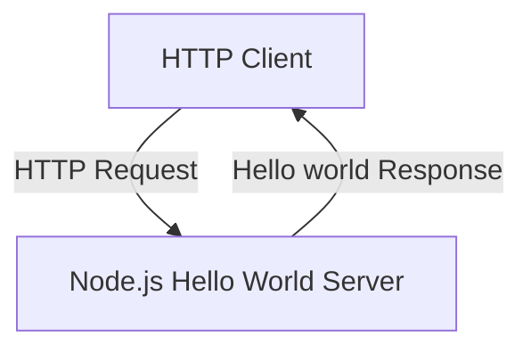
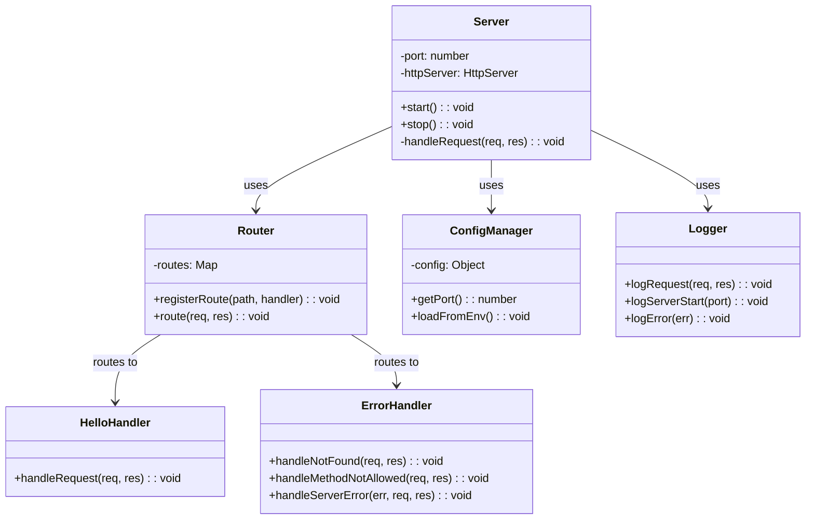
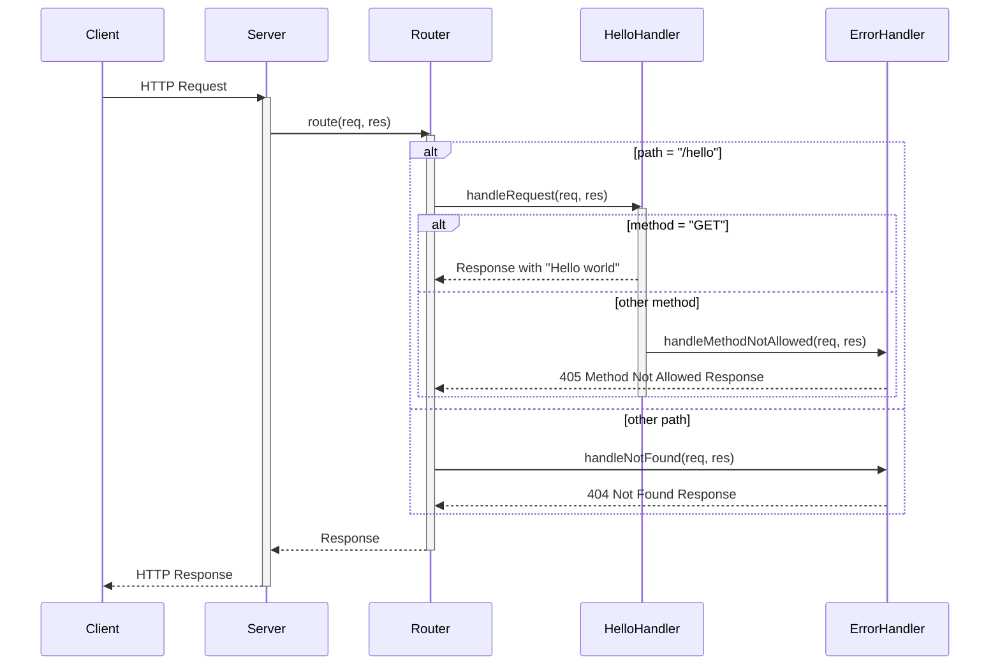
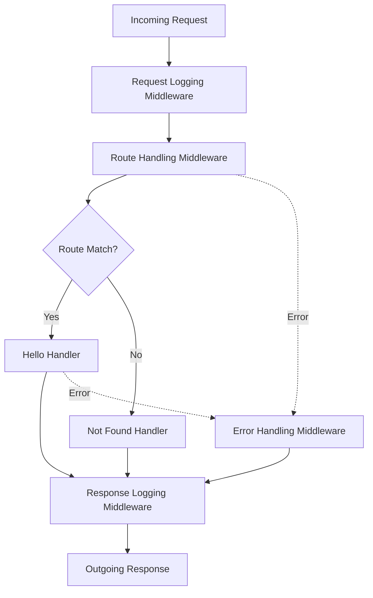
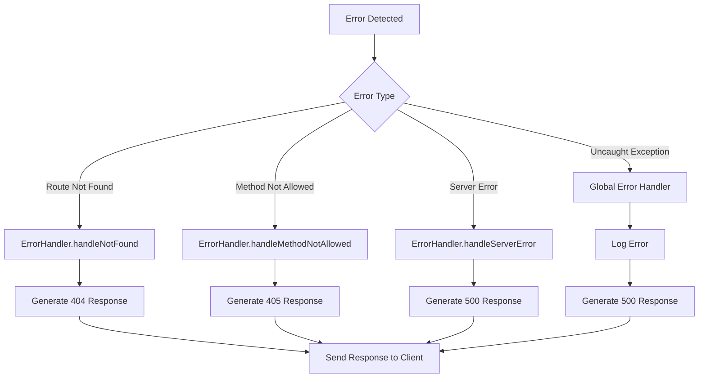
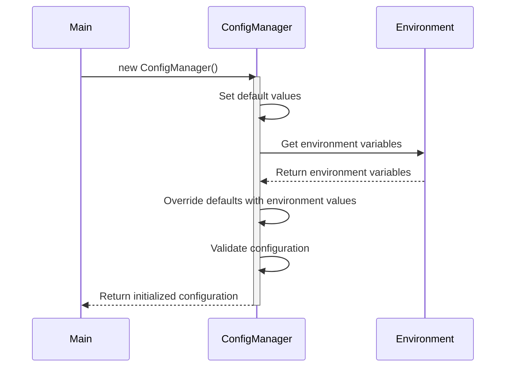
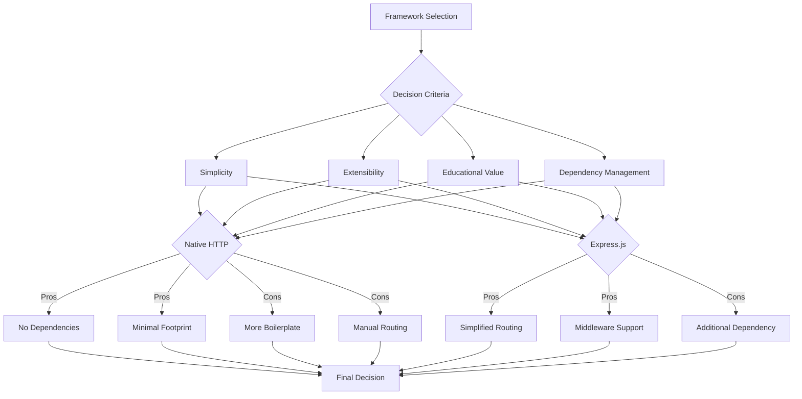

# Node.js Hello World Application Architecture

## Table of Contents
- [Architecture Overview](#architecture-overview)
  - [System Context](#system-context)
  - [Architectural Style](#architectural-style)
  - [Key Design Principles](#key-design-principles)
- [Component Architecture](#component-architecture)
  - [Core Components](#core-components)
  - [Component Relationships](#component-relationships)
  - [Component Interfaces](#component-interfaces)
- [Request Processing Flow](#request-processing-flow)
  - [Request Lifecycle](#request-lifecycle)
  - [Middleware Pipeline](#middleware-pipeline)
  - [Error Handling Flow](#error-handling-flow)
- [Configuration Management](#configuration-management)
  - [Environment Variables](#environment-variables)
  - [Configuration Loading](#configuration-loading)
  - [Configuration Access](#configuration-access)
- [Logging and Monitoring](#logging-and-monitoring)
  - [Logging Strategy](#logging-strategy)
  - [Request Logging](#request-logging)
  - [Health Monitoring](#health-monitoring)
- [Error Handling Strategy](#error-handling-strategy)
  - [Error Types](#error-types)
  - [Error Responses](#error-responses)
  - [Global Error Handling](#global-error-handling)
- [Security Considerations](#security-considerations)
  - [HTTP Headers](#http-headers)
  - [Input Validation](#input-validation)
  - [Error Information Disclosure](#error-information-disclosure)
- [Deployment Considerations](#deployment-considerations)
  - [Environment Setup](#environment-setup)
  - [Process Management](#process-management)
  - [Containerization](#containerization)
- [Design Decisions and Rationale](#design-decisions-and-rationale)
  - [Framework Selection](#framework-selection)
  - [Middleware Approach](#middleware-approach)
  - [Error Handling Design](#error-handling-design)
- [Future Considerations](#future-considerations)
  - [Scalability](#scalability)
  - [Additional Features](#additional-features)
  - [Testing Strategy](#testing-strategy)
- [References](#references)

## Architecture Overview

This document describes the architecture of a simple Node.js HTTP server application that exposes a single REST endpoint `/hello` which returns "Hello world" to clients. The application is designed to be a minimal, functional example of a Node.js web service that can serve as a learning tool or starter template.

### System Context

The Node.js Hello World application operates as a standalone educational tool within the following context:

- **Purpose**: The application serves as an entry-level tutorial for Node.js REST API development.
- **Users**: Developers learning Node.js, technical trainers, and software engineers requiring a baseline implementation.
- **Integration Points**: The application functions as a self-contained service with a well-defined HTTP interface that clients can interact with.

The system provides a clean, working reference implementation that demonstrates Node.js HTTP server fundamentals with minimal complexity.



### Architectural Style

The application follows a single-tier, monolithic architecture designed for educational purposes. Key aspects of the architectural style include:

- **Monolithic Design**: All components reside within a single Node.js process for simplicity.
- **Request-Response Pattern**: The application implements the standard HTTP request-response pattern.
- **Middleware Architecture**: The application uses a middleware approach (particularly if using Express.js) for processing requests.
- **Stateless Design**: The server maintains no state between requests, making it simple and scalable.

The architecture prioritizes simplicity and clarity over complex patterns that would be necessary for larger applications.

### Key Design Principles

The architecture is guided by the following design principles:

1. **Simplicity**: Keep the implementation as simple as possible to serve educational purposes.
2. **Clarity**: Prioritize readable, well-organized code over optimization.
3. **Minimal Dependencies**: Limit external dependencies to reduce complexity and potential security issues.
4. **Appropriate Error Handling**: Implement proper error handling to demonstrate best practices.
5. **Configuration Flexibility**: Allow basic configuration through environment variables.

These principles ensure the application serves its primary purpose as a learning tool while demonstrating software engineering best practices.

## Component Architecture

### Core Components

The application consists of the following core components:

| Component | Type | Responsibility | Dependencies |
|-----------|------|----------------|--------------|
| Server | Core | Initialize HTTP server and handle lifecycle | Node.js HTTP module or Express.js |
| Router | Core | Direct requests to appropriate handlers | Server component |
| HelloHandler | Feature | Process requests to `/hello` endpoint | Router component |
| ErrorHandler | Utility | Handle invalid routes and errors | Router component |
| ConfigManager | Utility | Manage server configuration | Environment variables |
| Logger | Utility | Log server events and requests | None |

Each component has a single responsibility, following the Single Responsibility Principle of software design.

### Component Relationships

The components interact in a structured manner, as illustrated in the following diagram:



The application uses a dependency injection pattern to facilitate component interactions and improve testability. Components are loosely coupled, with each component interacting with others through well-defined interfaces.

### Component Interfaces

Each component exposes a clean interface for interaction with other components:

**Server Component Interface**

| Method | Parameters | Return Type | Description |
|--------|------------|-------------|-------------|
| start | None | Promise\<void\> | Initializes and starts the HTTP server |
| stop | None | Promise\<void\> | Gracefully shuts down the HTTP server |

**Router Component Interface**

| Method | Parameters | Return Type | Description |
|--------|------------|-------------|-------------|
| registerRoute | path: string, method: string, handler: Function | void | Registers a handler function for a specific path and HTTP method |
| route | req: HttpRequest, res: HttpResponse | void | Routes an incoming request to the appropriate handler |

**HelloHandler Component Interface**

| Method | Parameters | Return Type | Description |
|--------|------------|-------------|-------------|
| handleRequest | req: HttpRequest, res: HttpResponse | void | Processes requests to the `/hello` endpoint |

**ErrorHandler Component Interface**

| Method | Parameters | Return Type | Description |
|--------|------------|-------------|-------------|
| handleNotFound | req: HttpRequest, res: HttpResponse | void | Handles requests to non-existent routes |
| handleMethodNotAllowed | req: HttpRequest, res: HttpResponse | void | Handles requests with unsupported HTTP methods |
| handleServerError | err: Error, req: HttpRequest, res: HttpResponse | void | Handles server-side errors |

**ConfigManager Component Interface**

| Method | Parameters | Return Type | Description |
|--------|------------|-------------|-------------|
| getPort | None | number | Returns the configured port number |
| loadFromEnv | None | void | Loads configuration from environment variables |

**Logger Component Interface**

| Method | Parameters | Return Type | Description |
|--------|------------|-------------|-------------|
| logRequest | req: HttpRequest, res: HttpResponse | void | Logs information about an HTTP request and response |
| logServerStart | port: number | void | Logs server startup information |
| logError | err: Error | void | Logs error information |

## Request Processing Flow

### Request Lifecycle

The application processes HTTP requests through the following lifecycle stages:

1. **Connection Acceptance**: The HTTP server accepts incoming TCP connections.
2. **Request Parsing**: The incoming HTTP request is parsed to extract method, path, headers, and body.
3. **Route Matching**: The router matches the request path and method to the appropriate handler.
4. **Request Processing**: The matched handler processes the request and generates a response.
5. **Response Generation**: The response is prepared with appropriate status code, headers, and body.
6. **Response Transmission**: The response is sent back to the client.
7. **Connection Handling**: The connection is either closed or kept alive based on HTTP headers.



### Middleware Pipeline

If using Express.js, the application employs a middleware pipeline for processing requests. Middleware functions execute in sequence, each potentially modifying the request or response before passing control to the next middleware.

The middleware pipeline for this application includes:

1. **Request Logging Middleware**: Logs incoming requests with method, path, and timestamp.
2. **Route Handling Middleware**: Routes requests to the appropriate handler based on path and method.
3. **Response Logging Middleware**: Logs outgoing responses with status code and response time.
4. **Error Handling Middleware**: Catches and processes errors that occur during request handling.



### Error Handling Flow

The application implements a comprehensive error handling flow:

1. **Component-Level Error Handling**: Each component handles errors specific to its responsibilities.
2. **Route-Level Error Handling**: The router catches and processes routing errors (e.g., path not found).
3. **Method-Level Error Handling**: Handlers validate HTTP methods and reject unsupported methods.
4. **Global Error Handling**: Uncaught exceptions are captured by a global error handler to prevent server crashes.



## Configuration Management

### Environment Variables

The application supports configuration through the following environment variables:

| Variable | Default | Description | Example |
|----------|---------|-------------|---------|
| PORT | 3000 | TCP port on which the HTTP server listens | `PORT=8080 node server.js` |
| HOST | 0.0.0.0 | Host address to bind the server | `HOST=127.0.0.1 node server.js` |
| NODE_ENV | development | Application environment | `NODE_ENV=production node server.js` |
| LOG_LEVEL | info | Logging verbosity level | `LOG_LEVEL=debug node server.js` |

These environment variables allow basic configuration of the application without modifying the code.

### Configuration Loading

Configuration is loaded at application startup through the following process:

1. **Default Configuration**: The ConfigManager initializes with default values.
2. **Environment Variables**: Environment variables override defaults if present.
3. **Validation**: Configuration values are validated for correctness (e.g., port is a valid number).
4. **Normalization**: Values are converted to appropriate types (e.g., string to number for port).



### Configuration Access

Components access configuration through the ConfigManager using the following approaches:

1. **Dependency Injection**: The ConfigManager is injected into components that need configuration.
2. **Accessor Methods**: Components use accessor methods like `getPort()` to retrieve specific configuration values.
3. **Immutability**: Configuration is treated as immutable after application startup.

Example configuration access:

```javascript
// Server component accessing port configuration
constructor(configManager, router, logger) {
  this.port = configManager.getPort();
  this.router = router;
  this.logger = logger;
}
```

## Logging and Monitoring

### Logging Strategy

The application implements a simple logging strategy:

| Log Level | Purpose | Example |
|-----------|---------|---------|
| error | Critical issues that require immediate attention | Server startup failures, uncaught exceptions |
| warn | Potential issues that don't prevent operation | Invalid requests, deprecated feature usage |
| info | General operational information | Server startup, request completion |
| debug | Detailed information for debugging | Request details, configuration values |

Logs include a timestamp, log level, component name, and message for proper context.

### Request Logging

The application logs the following information for each HTTP request:

- Timestamp of the request
- HTTP method
- Request path
- Client IP address
- User agent (if available)
- Response status code
- Response time in milliseconds

Example request log:

```
[2023-05-10T15:30:45.123Z] INFO [Server]: GET /hello 200 5ms - ::1 - Mozilla/5.0 (Windows NT 10.0; Win64; x64)
```

### Health Monitoring

The application includes a basic health monitoring endpoint:

| Endpoint | Method | Response | Purpose |
|----------|--------|----------|---------|
| `/health` | GET | 200 OK with uptime | Verify server is running and responsive |

The health endpoint returns a JSON response with the following information:

```json
{
  "status": "up",
  "uptime": "10m 30s",
  "timestamp": "2023-05-10T15:30:45.123Z"
}
```

This endpoint can be used by monitoring tools to verify the application is operational.

## Error Handling Strategy

### Error Types

The application handles the following types of errors:

| Error Type | Description | Example |
|------------|-------------|---------|
| Route Not Found | Request for non-existent path | GET /unknown |
| Method Not Allowed | Request with unsupported HTTP method | POST /hello |
| Validation Error | Request with invalid parameters | Invalid query parameters |
| Server Error | Unexpected error during request processing | Database connection failure |
| Startup Error | Error during server initialization | Port already in use |

Each error type is handled appropriately to provide meaningful feedback to clients.

### Error Responses

The application generates appropriate HTTP responses for different error types:

| Error Type | Status Code | Response Body | Headers |
|------------|-------------|---------------|---------|
| Route Not Found | 404 Not Found | "Not Found" | Content-Type: text/plain |
| Method Not Allowed | 405 Method Not Allowed | "Method Not Allowed" | Content-Type: text/plain<br>Allow: GET |
| Validation Error | 400 Bad Request | "Bad Request: [details]" | Content-Type: text/plain |
| Server Error | 500 Internal Server Error | "Internal Server Error" | Content-Type: text/plain |

Responses include appropriate status codes and headers to communicate the error condition to clients.

### Global Error Handling

The application implements global error handling to catch uncaught exceptions:

1. **Process-Level Handlers**: Registers handlers for `uncaughtException` and `unhandledRejection` events.
2. **Graceful Degradation**: Attempts to respond to clients even when errors occur.
3. **Fail Fast**: Terminates the process for critical errors that compromise the application's integrity.

Example global error handling:

```javascript
process.on('uncaughtException', (err) => {
  logger.error('Uncaught exception', err);
  // Attempt graceful shutdown
  server.stop()
    .then(() => process.exit(1))
    .catch(() => process.exit(1));
});
```

## Security Considerations

### HTTP Headers

The application sets the following security-related HTTP headers:

| Header | Value | Purpose |
|--------|-------|---------|
| X-Content-Type-Options | nosniff | Prevent MIME type sniffing |
| X-Frame-Options | DENY | Prevent clickjacking attacks |
| Content-Security-Policy | default-src 'self' | Mitigate XSS attacks |
| Cache-Control | no-store | Prevent sensitive data caching |

These headers enhance the security posture of the application, even for this simple use case.

### Input Validation

The application validates input to prevent security issues:

1. **Method Validation**: Ensures only allowed HTTP methods are accepted (GET for `/hello`).
2. **Path Validation**: Validates request paths to prevent path traversal attacks.
3. **Strict Routing**: Implements strict route matching to prevent unexpected behavior.

Input validation occurs early in the request processing pipeline to reject invalid requests before further processing.

### Error Information Disclosure

The application follows these principles to prevent information disclosure through errors:

1. **Generic Error Messages**: Public error messages don't reveal implementation details.
2. **Detailed Logging**: Internal logs contain detailed error information for debugging.
3. **Stack Trace Handling**: Stack traces are never sent to clients, only logged internally.
4. **Sensitive Data Filtering**: Logs are filtered to remove any potentially sensitive information.

This approach ensures clients receive appropriate error information without exposing internal details.

## Deployment Considerations

### Environment Setup

The application can be deployed in various environments:

| Environment | Description | Considerations |
|-------------|-------------|----------------|
| Development | Local development environment | Use nodemon for auto-restart, verbose logging |
| Testing | Environment for automated testing | Separate port for test runs, minimal logging |
| Production | Live environment for real users | Process manager, appropriate logging level |

Each environment may require different configuration values, particularly for logging level and port.

### Process Management

For production deployments, a process manager is recommended:

| Tool | Purpose | Features |
|------|---------|----------|
| PM2 | Node.js process manager | Auto-restart, clustering, log management |
| Docker | Container platform | Isolation, resource management, orchestration |
| Systemd | Linux service manager | System-level service management |

Process management ensures the application remains available and recovers from failures automatically.

### Containerization

The application can be containerized using Docker:

```dockerfile
FROM node:18-alpine

WORKDIR /app

COPY package*.json ./
RUN npm install --production

COPY . .

ENV PORT=3000
ENV NODE_ENV=production

EXPOSE 3000

CMD ["node", "server.js"]
```

Containerization provides consistent deployment across different environments and simplifies orchestration with tools like Docker Compose or Kubernetes.

## Design Decisions and Rationale

### Framework Selection

The application can be implemented using either the native Node.js HTTP module or Express.js:

| Option | Pros | Cons | Decision |
|--------|------|------|----------|
| Native HTTP Module | No dependencies, minimal footprint | More boilerplate code, manual routing | Acceptable for minimal requirements |
| Express.js | Simplified routing, middleware support | Additional dependency | Preferred for better structure and extensibility |

Express.js is recommended for its middleware architecture, simplified routing, and wide adoption in the Node.js ecosystem. However, the native HTTP module is a valid alternative for educational purposes focusing on Node.js fundamentals.



### Middleware Approach

The middleware approach (particularly when using Express.js) provides several benefits:

1. **Separation of Concerns**: Each middleware focuses on a specific aspect of request processing.
2. **Reusability**: Middleware can be reused across different routes and applications.
3. **Extensibility**: New functionality can be added by inserting middleware into the pipeline.
4. **Readability**: The middleware pipeline clearly expresses the request processing flow.

This approach is chosen for its clarity and alignment with Node.js best practices, even for this simple application.

### Error Handling Design

The centralized error handling approach was selected for the following reasons:

1. **Consistency**: Ensures errors are handled consistently throughout the application.
2. **Separation of Concerns**: Error handling logic is separated from business logic.
3. **Simplicity**: Components can focus on their core responsibilities and delegate error handling.
4. **Completeness**: Ensures all types of errors are caught and handled appropriately.

This approach demonstrates best practices for error handling in Node.js applications, which is valuable for educational purposes.

## Future Considerations

### Scalability

While the current application is designed for educational purposes, it could be extended for higher scalability:

| Approach | Implementation | Benefit |
|----------|----------------|---------|
| Horizontal Scaling | Multiple instances behind a load balancer | Increased throughput, redundancy |
| Process Clustering | Node.js cluster module or PM2 cluster mode | Utilize multiple CPU cores |
| Caching | Add response caching middleware | Reduced computation, faster responses |
| Connection Pooling | If adding database connections | Efficient resource utilization |

These approaches would be appropriate if the application were extended beyond its educational purpose.

### Additional Features

The architecture could support the following additional features:

1. **Additional Endpoints**: The router can easily accommodate new endpoints beyond `/hello`.
2. **Authentication**: Middleware could be added for authentication and authorization.
3. **Rate Limiting**: Middleware could implement rate limiting to prevent abuse.
4. **API Documentation**: Swagger/OpenAPI documentation could be generated.
5. **Database Integration**: Data access components could be added for persistence.

The current architecture provides a solid foundation for these extensions while maintaining separation of concerns.

### Testing Strategy

A comprehensive testing strategy would include:

| Test Type | Tools | Purpose |
|-----------|-------|---------|
| Unit Tests | Jest, Mocha/Chai | Test individual components in isolation |
| Integration Tests | Supertest | Test component interactions |
| End-to-End Tests | Supertest, Axios | Test complete request flows |
| Load Tests | autocannon, k6 | Verify performance under load |

Testing should be automated through CI/CD pipelines to ensure ongoing quality as the application evolves.

## References

- [Express.js Documentation](https://expressjs.com/)
- [Node.js Documentation](https://nodejs.org/en/docs/)
- [HTTP Status Codes](https://developer.mozilla.org/en-US/docs/Web/HTTP/Status)